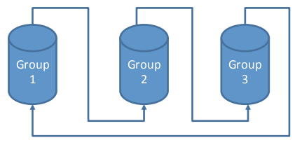
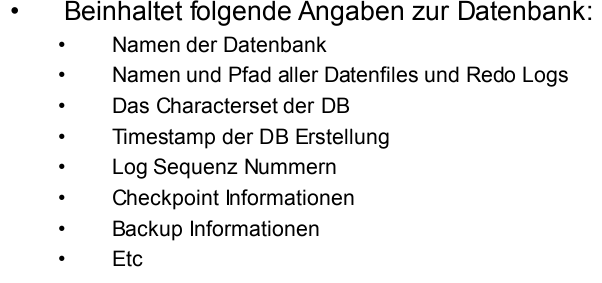
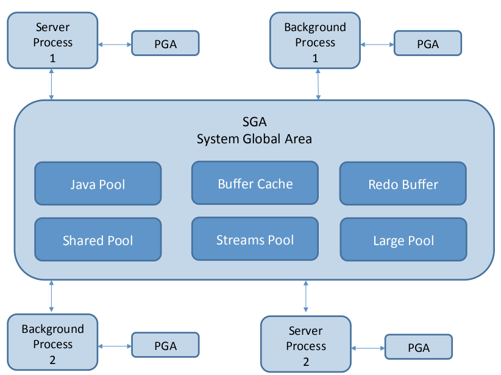

# Komponenten einer Datenbank

| Instanz:   | Memory Bereich                      |
|------------|-------------------------------------|
| Binaries:  | Ausführbares zeugs, auch scripts... |
| Datenbank: | Datenbank Files                     |

# Binaries

- Programme die installiert werden
- müssen nicht zwingend Binär sein --> alles was im ${ORACHLE_HOME} ist
- ${ORACLE_HOME}/dbs: default location für parameter File, Passwort File z.T. auch Datenfiles
  - best practices: link them. Weil alles im ORACLE_HOME kann bei update und so changen
- ${ORACLE_HOME}/network/admin: network config
  - best practices: link them. Weil alles im ORACLE_HOME kann bei update und so changen
- ${ORACHLE_HOME}/OPatch: binary zum Patchen von Oracle

# Datafiles

- Binäres format
- Beinhaltet alle Tabelspaces und deren Inahlt also alle Daten welche in der DB gespeichert sind.
- Sind das `Herz` der DB

# Redo Log Files

- Binäres format
- Schreiboperationen werden in Redo Log geschrieben (Tranactions)
- Bei crash, ist memory weg. Nach Commit wird die Operation auf Disk geschrieben, somit kann bei crash die letzten Transaktionen nachgefahren werden
- sollten redundant sein, weil sehr wichtig
  - 3 Gruppen / 2 Files:

  

# Control File

- Binär format
- 2 Fach redundanz - Best Practices

- System change number (ändert bei jeder Schreiboperation) und wird in Controll File geschrieben
  - Wird verwendet um Redo Logs nach crasch einzuspielen

# Parameter File

- Alte Version: ASCII File (init${ORACLE_SID}.ora)
- Neue Version: Binary format (spfile${ORACLE_SID}.ora)
- Alle nicht "Default" Datanbankparameter
  - Default Werte können von Version zu Version ändern
- Binäres Format sollte verwendet werden, weil: Dinge wie z.B. Memory können dynamisch ändern,  geht nur bei  Binär
  - Hochverfügbarkeit (Dataguard, sendet Redo Logs zu anderer DB, lagged) benötigt binäre Format

# Instanz (Memory Bereich)

- PGA: Memmory Bereiche für Sessions
- SGA: System Global Area: Shared Pool
  - buffer cache, Database buffer cache. Alle daten die geladen werlden `(SELECT *)` werden im Buffer cache (memory) gespeichert
- Server Prozesse: verbindet sich Client auf DB wird prozess gestartet
- PMON: Porgramm monitor, checkt alle prozesse
- Logwriter: LOGW0 --> kann mehrere haben
- DBW0 --> schreibt in DB
- Archive Process: redo Logrotation

# Oracle Memory Struktur

# SGA - System Global Area

- SGA ist memory bereich mit verschiedenen unterbereichen:
  - Shared Pool
  - Large Pool
  - Buffer cache
