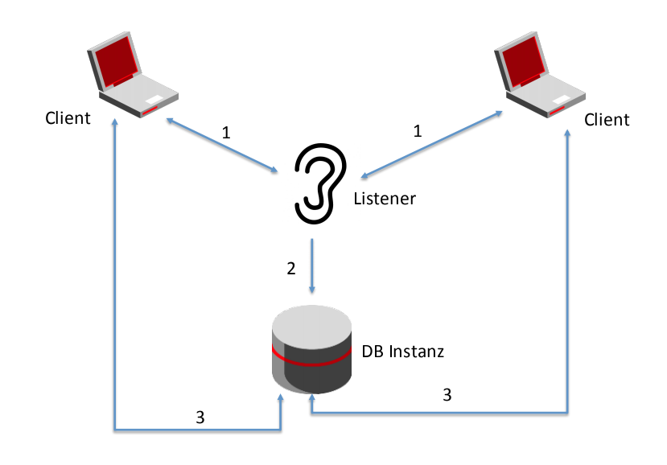
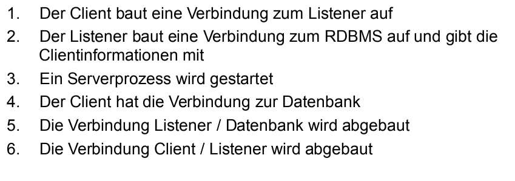
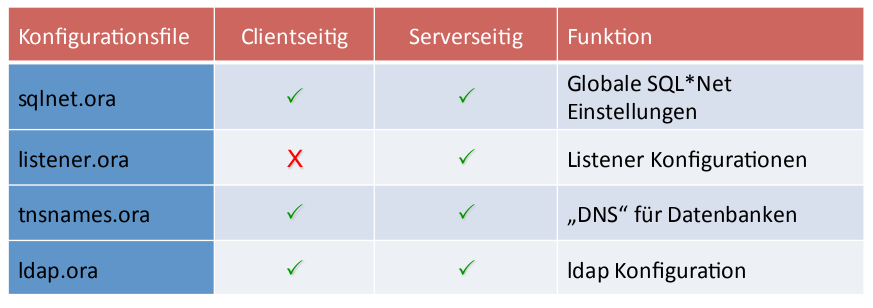
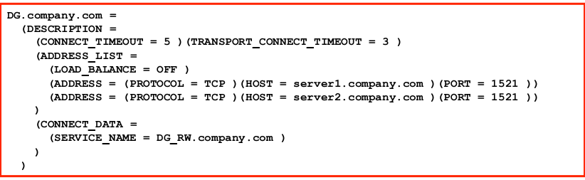
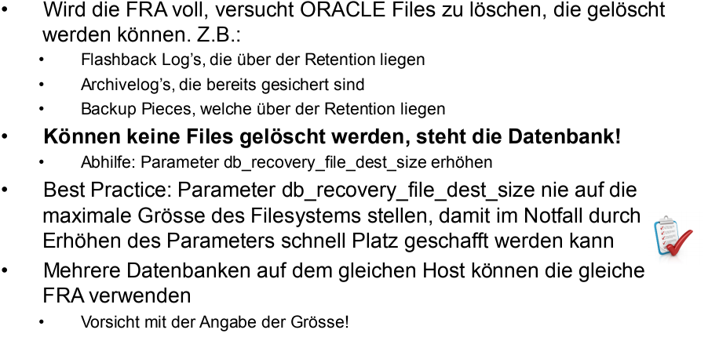
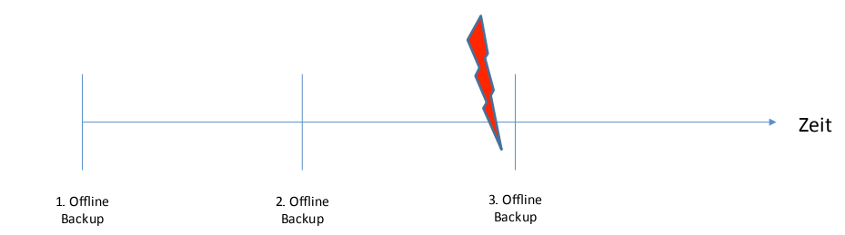

# Oracle Net Services
- Früher SQL*Net, ist das gleiche wie Oracle Net (services)
- Ohne Passwort file nicht möglich remote verbindung als `sys`
- beq ist local prozess, nicht via listener

## Listener

DB Instanz läuft auf keinem Port, muss durch Listener initiert werden. Datanebank verbindet sich mit client.
Direkter zugriff auf die DB gibt es nicht.

- Sobald DB verbindung aufgebaut ist kann Listener gestoppt werden, bestehende Verbindunugen werden nicht getrennt.
- Defaults
  - Port: 1521
  - Name: LISTENER
- Mehere Listener möglich, z.B. per Applikation, oder ein Listener für Administration.
- Ein Listener kann mehrere DBs bedienen
  - auch unterschiedliche oracle versionen, nicht supported mit altem Listener auf neue DB (immer listener von neuster, installiertet version verwenden)
- DB registriert sich automatisch wenn Listener auf default port
  - wenn nicht default port, oder remote listener. Muss DB konfiguriert werden. Parameter: "local_listener"

### Start / Stop

~~~bash
oracle@vm100:/u01/app/oracle/network/admin/ [rdbms_11201_xe] listener.ksh
2018-03-09_08:29:47 05065 ERR: listener.ksh called with wrong parameters

SYNOPSIS
       listener.ksh {start|stop} [ -u run_as_user ] [-f] [-v] [-?] [ LSNR1 ... LSNRn ]

DESCRIPTION
       listener.ksh is used to start or stop (one or many) Oracle
       listener.  It  can be used interactively or in a runlevel-
       script. It offers the following enhanced functionality
       -  start or stop of all (default) or selected listeners
       -  start or stop a listener with another userid
       -  use of passwords for the listener

For detailed documentation, see man-page of listener.ksh

2018-03-09_08:29:47 05065 END   of listener.ksh ($Name: basenv-15.11.final.a $, $Revision: 705 $), exit code 1
~~~

listener.ksh verwendet die Konfiguration des Listeners.

lsnrctl verwendet immer die gesetzten Umgebungsvariablen.

~~~bash
oracle@vm100:/u01/app/oracle/network/admin/ [rdbms_11201_xe] lsnrctl

LSNRCTL for Linux: Version 11.2.0.2.0 - Production on 09-MAR-2018 08:30:32

Copyright (c) 1991, 2011, Oracle.  All rights reserved.

Welcome to LSNRCTL, type "help" for information.

LSNRCTL> help
The following operations are available
An asterisk (*) denotes a modifier or extended command:

start               stop                status              
services            version             reload              
save_config         trace               spawn               
change_password     quit                exit                
set*                show*               

LSNRCTL>
~~~

~~~bash
oracle@vm100:/u01/app/oracle/network/admin/ [rdbms_11201_xe] u

TYPE (Cluster|DG) : SID/PROCESS     STATUS  HOME
---------------------------------------------------------------------------

Dummy rdbms       : rdbms_11201_xe  n/a     /u01/app/oracle/product/11.2.0/xe
Dummy rdbms       : rdbms_12102_ee  n/a     /u01/app/oracle/product/12.1.0.2

DB-instance (N|N) : EE12102         open    /u01/app/oracle/product/12.1.0.2
DB-instance (N|N) : EE12DBCA        open    /u01/app/oracle/product/12.1.0.2
DB-instance (N|N) : XE112           open    /u01/app/oracle/product/11.2.0/xe

Listener          : LISTENER        up      /u01/app/oracle/product/11.2.0/xe

oracle@vm100:/u01/app/oracle/network/admin/ [rdbms_11201_xe] ps -ef | grep tns
root        22     2  0 08:10 ?        00:00:00 [netns]
oracle    2296     1  0 08:11 ?        00:00:00 /u01/app/oracle/product/11.2.0/xe/bin/tnslsnr LISTENER -inherit
oracle    5270  3634  0 08:32 pts/0    00:00:00 grep --color=auto tns
oracle@vm100:/u01/app/oracle/network/admin/ [rdbms_11201_xe]

oracle@vm100:/u01/app/oracle/network/admin/ [rdbms_11201_xe] lsnrctl status LISTENER

LSNRCTL for Linux: Version 11.2.0.2.0 - Production on 09-MAR-2018 08:33:45

Copyright (c) 1991, 2011, Oracle.  All rights reserved.

Connecting to (ADDRESS=(PROTOCOL=IPC)(KEY=LISTENER))
STATUS of the LISTENER
------------------------
Alias                     LISTENER
Version                   TNSLSNR for Linux: Version 11.2.0.2.0 - Production
Start Date                09-MAR-2018 08:11:11
Uptime                    0 days 0 hr. 22 min. 34 sec
Trace Level               off
Security                  ON: Local OS Authentication
SNMP                      OFF
Listener Parameter File   /u01/app/oracle/network/admin/listener.ora
Listener Log File         /u01/app/oracle/diag/tnslsnr/vm100/listener/alert/log.xml
Listening Endpoints Summary...
  (DESCRIPTION=(ADDRESS=(PROTOCOL=ipc)(KEY=LISTENER)))
  (DESCRIPTION=(ADDRESS=(PROTOCOL=tcp)(HOST=vm100)(PORT=1521)))
Services Summary...
Service "XE112" has 1 instance(s).
  Instance "XE112", status UNKNOWN, has 1 handler(s) for this service...
Service "XE112.tsbe.ch" has 1 instance(s).
  Instance "XE112", status READY, has 1 handler(s) for this service...
Service "XE112_SITE1.tsbe.ch" has 1 instance(s).
  Instance "XE112", status READY, has 1 handler(s) for this service...
Service "rdbms_11201_xe" has 1 instance(s).
  Instance "rdbms_11201_xe", status UNKNOWN, has 1 handler(s) for this service...
The command completed successfully

oracle@vm100:/u01/app/oracle/network/admin/ [EE12102] lsnrctl reload LISTENER
LSNRCTL for Linux: Version 12.1.0.2.0 - Production on 09-MAR-2018 08:46:27
Copyright (c) 1991, 2014, Oracle.  All rights reserved.
Connecting to (ADDRESS=(PROTOCOL=IPC)(KEY=LISTENER))
The command completed successfully
~~~

## Konfiguration

- Oracle Net wird serverseitig & clientseitg konfiguriert
  - diff: server hat listener / client nicht
- TNSadmin per default: ORACLE_HOME/network/admin
- ${TNS_ADMIN} auf zentralles Verzeichnis legen, weil bei updates gibt es sonst meherer TNSadmins

### TNS_ADMIN

- Netzwerkkonfiguration

~~~bash
oracle@vm100:/u01/app/oracle/network/admin/ [rdbms_11201_xe] tnsping xe112

TNS Ping Utility for Linux: Version 11.2.0.2.0 - Production on 09-MAR-2018 08:24:48

Copyright (c) 1997, 2011, Oracle.  All rights reserved.

Used parameter files:
/u01/app/oracle/network/admin/sqlnet.ora

Used TNSNAMES adapter to resolve the alias
Attempting to contact (DESCRIPTION = (ADDRESS = (PROTOCOL = TCP)(HOST = vm100.tsbetest.ch)(PORT = 1521)) (CONNECT_DATA = (SERVER = DEDICATED) (SERVICE_NAME = XE112.tsbe.ch)))
OK (0 msec)
~~~

## Remote Zugriffe
- Immer via LISTENER
- Wichtigsten arten des Remote Zugriffs:
  - tnsnames
  - ldap (gleich wie tnsnames, aber anfrage gegen LDAP nicht file)
  - ezconnect (Easy connect)
- Um Remote verbindung aufbauen zu können braucht es:
  - tns eintrag in tnsnames oder LDAP
  - Easy connect: Hostname, Port, Service Name welcher beim Listener registriert ist

### SQL*Plus

~~~bash
SQL> connect [username]/[password]@[TNS Eintrag]
SQL> connect system/manager@TNSNAME.com
~~~

### Easy connect

~~~bash
SQL> connect [username]/[password]@[hostname]:[Port]/[Service Name]
SQL> connect system/manager@vm100.tsbe.ch:1521/XE112.tsbe.ch
~~~

Service Name der Datenbank:

~~~bash
SQL> show parameter service
~~~

## listener.ora

~~~
LISTENER =
    (ADDRESS_LIST =
        (ADDRESS = (PROTOCOL=IPC )(KEY=LISTENER ))
        # for external procedure calls, create a separate listener
        # See basenv_user_guide.pdf for details (chapter of listener.ksh )
        (ADDRESS =
            (PROTOCOL = TCP )
            (HOST = vm100.tsbetest.ch )
            (PORT = 1521 )
        )
    )

    SID_LIST_LISTENER =
        (SID_LIST =
            (SID_DESC =
                # Next line is necessary for dataguard >= 10g
                # (GLOBAL_DBNAME = DB_UNIQUE_NAME_DGMGRL.DB_DOMAIN )
                (SID_NAME      = rdbms_11201_xe )
                (ORACLE_HOME   = /u01/app/oracle/product/11.2.0/xe )
    #            (SID_NAME      = rdbms_12102_ee )
    #            (ORACLE_HOME   = /u01/app/oracle/product/12.1.0.2 )
            )
            (SID_DESC =
                (SID_NAME      = XE112 )
                (ORACLE_HOME   = /u01/app/oracle/product/11.2.0/xe )
            )
        )
~~~
Baseenv verwedent das home vom ersten Eintrag SID_LIST_LISTENER.

## sqlnet.ora

~~~
NAMES.DEFAULT_DOMAIN=tsbe.ch # Default domain, wie serach domain
NAMES.DIRECTORY_PATH=(ldap, tnsnames, ezconnect) # reihenfolge wo schauen, ezconnect ist zugelassen
~~~

## tnsnames.ora

- Globaler "DNS" für oracle DBs
- Sollte zentral (z.b. netzwerkshare) abgelegt sein
- SID sollte nicht mehr zum Verbinden verwendet werden, wegen HA und Admin things.
  - DataGuard: Keine Unterscheidung zwischen Primary / Standby möglich
  - RAC: Kein Failover des Services möglich
  - Generell: Das Verbinden mit einer Datenbank für einen bestimmten Service kann nicht unterbunden werden

~~~bash
XE112.TSBE.CH =
  (DESCRIPTION =
    (ADDRESS = (PROTOCOL = TCP)(HOST = vm100.tsbetest.ch)(PORT = 1521))
    (CONNECT_DATA =
      (SERVER = DEDICATED)
      (SERVICE_NAME = XE112.tsbe.ch)
    )
  )
~~~

### HA - Dataguard

## ldap.ora

~~~bash
DIRECTORY_SERVERS= (oid1:389:636, oid2:389:636)
DEFAULT_ADMIN_CONTEXT = "dc=tsbe.ch"
DIRECTORY_SERVER_TYPE = OID
~~~

- OID Server sind Oracle Internet Directory (LDAP von Oracle)
- Ab 18c ist offiziel M$ AD supported
  - geht schon jetzt, aber nicht supported

# Backup / Recovery

## Starten von DBs

3 verschiedene Startmodis:
- 1) startup nomount
  - nur parameter file wird geladen
  - recovery kann gemacht werden
  - controllfiles können restored werden
- 2) startup mount
  - controllfile wird neben dem Parameter file zusätzlich geladen
  - DB kann geöffnet werden (rw/ro)
  - Datenfiles können restored werden
- 3) startup (default)
  - started eine Instanz und öffnet diese (gleich wie 1 & 2)

~~~bash
oracle@vm100:~/ [XE112] sqh

SQL*Plus: Release 11.2.0.2.0 Production on Fri Mar 9 10:07:10 2018

Copyright (c) 1982, 2011, Oracle.  All rights reserved.

Connected to:
Oracle Database 11g Express Edition Release 11.2.0.2.0 - 64bit Production

SQL> shutdown;
Database closed.
Database dismounted.
ORACLE instance shut down.
SQL> startup nomount
ORACLE instance started.

Total System Global Area  267227136 bytes
Fixed Size                  2225640 bytes
Variable Size             163580440 bytes
Database Buffers           96468992 bytes
Redo Buffers                4952064 bytes
SQL> alter database mount
  2  ;

Database altered.

SQL> select open_mode from v$database;

OPEN_MODE
--------------------
MOUNTED

SQL> alter database open;

Database altered.

SQL> select open_mode from v$database;

OPEN_MODE
--------------------
READ WRITE
~~~

## Stoppen von DBs
- shutdown immediate;
  - Beendet alle Transaktionen mit Rollback
  - Datenbank wird sauber, konsistent gestoppt
- shutdown transactional;
  - wartet bis alle transaktionen beended sind (lässt keine neuen zu)
  - kann ewig dauern (weil commit nicht abgesetzt)
  - wird selten verwendet
- shutdown;
  - stoppt DB in default modus (heute: shutdown immediate, früher shutdown transactional)
- shutdown abort;
  - crashed bzw. Killt instanz
  - DB wird nicht sauber gestoppt und ist nicht konsistent
  - beim Startup der DB wird ein Crash Recovery gemacht
  - Manchmal "hängen" sessions dann kommt die DB mit "immediate" nicht mehr runter
  - sollte möglichst nicht verwendet werden, ist aber nicht so dramatisch weil Oracle gutes crash recovery.

## neustarten von DBs
- startup force [mount|nomount]
  - macht: shutdown abort && startup [mount|nomount]
- Muss mit bedacht eingesetz werden: abort crashed DB
-

## Log Mode
- redo logs werden wie logrotate beschrieben, siehe 01 Arhcitektur
- NOARCHIVELOG Modus:
  - Redo logs werden voll geschrieben bis sie voll sind oder ein LOG switch gemacht Wird
  - Sind alle Redo Logs voll geschrieben, wird das erste Redo Log wieder neu beschrieben

~~~bash
SQL>  select log_mode from v$database;

LOG_MODE
------------
NOARCHIVELOG
~~~

~~~bash
SQL> desc v$instance;
 Name                                      Null?    Type
 ----------------------------------------- -------- ----------------------------
 INSTANCE_NUMBER                                    NUMBER
 INSTANCE_NAME                                      VARCHAR2(16)
 HOST_NAME                                          VARCHAR2(64)
 VERSION                                            VARCHAR2(17)
 STARTUP_TIME                                       DATE
 STATUS                                             VARCHAR2(12)
 PARALLEL                                           VARCHAR2(3)
 THREAD#                                            NUMBER
 ARCHIVER                                           VARCHAR2(7)
 LOG_SWITCH_WAIT                                    VARCHAR2(15)
 LOGINS                                             VARCHAR2(10)
 SHUTDOWN_PENDING                                   VARCHAR2(3)
 DATABASE_STATUS                                    VARCHAR2(17)
 INSTANCE_ROLE                                      VARCHAR2(18)
 ACTIVE_STATE                                       VARCHAR2(9)
 BLOCKED                                            VARCHAR2(3)
 EDITION                                            VARCHAR2(7)

SQL> select STARTUP_TIME from v$instance;

STARTUP_T
---------
09-MAR-18

SQL> select DATABASE_STATUS from v$instance;

DATABASE_STATUS
-----------------
ACTIVE

SQL> select STATUS from v$instance;

STATUS
------------
OPEN

SQL> select VERSION from v$instance;

VERSION
-----------------
11.2.0.2.0
~~~

### Archivieren von Logs

~~~bash
SQL> show parameter log_archive_dest_1;

NAME                                 TYPE        VALUE
------------------------------------ ----------- ------------------------------
log_archive_dest_1                   string      LOCATION=USE_DB_RECOVERY_FILE_
                                                 DEST
log_archive_dest_10                  string
log_archive_dest_11                  string
log_archive_dest_12                  string
log_archive_dest_13                  string
log_archive_dest_14                  string
log_archive_dest_15                  string
log_archive_dest_16                  string
log_archive_dest_17                  string
log_archive_dest_18                  string

NAME                                 TYPE        VALUE
------------------------------------ ----------- ------------------------------
log_archive_dest_19                  string
~~~

### ARchivierte Logs

~~~bash
SQL> desc v$archived_log;
 Name                                      Null?    Type
 ----------------------------------------- -------- ----------------------------
 RECID                                              NUMBER
 STAMP                                              NUMBER
 NAME                                               VARCHAR2(513)
 DEST_ID                                            NUMBER
 THREAD#                                            NUMBER
 SEQUENCE#                                          NUMBER
 RESETLOGS_CHANGE#                                  NUMBER
 RESETLOGS_TIME                                     DATE
 RESETLOGS_ID                                       NUMBER
 FIRST_CHANGE#                                      NUMBER
 FIRST_TIME                                         DATE
 NEXT_CHANGE#                                       NUMBER
 NEXT_TIME                                          DATE
 BLOCKS                                             NUMBER
 BLOCK_SIZE                                         NUMBER
 CREATOR                                            VARCHAR2(7)
 REGISTRAR                                          VARCHAR2(7)
 STANDBY_DEST                                       VARCHAR2(3)
 ARCHIVED                                           VARCHAR2(3)
 APPLIED                                            VARCHAR2(9)
 DELETED                                            VARCHAR2(3)
 STATUS                                             VARCHAR2(1)
 COMPLETION_TIME                                    DATE
 DICTIONARY_BEGIN                                   VARCHAR2(3)
 DICTIONARY_END                                     VARCHAR2(3)
 END_OF_REDO                                        VARCHAR2(3)
 BACKUP_COUNT                                       NUMBER
 ARCHIVAL_THREAD#                                   NUMBER
 ACTIVATION#                                        NUMBER
 IS_RECOVERY_DEST_FILE                              VARCHAR2(3)
 COMPRESSED                                         VARCHAR2(3)
 FAL                                                VARCHAR2(3)
 END_OF_REDO_TYPE                                   VARCHAR2(10)
 BACKED_BY_VSS                                      VARCHAR2(3)
~~~

## Fast Recovery Area (FRA)
- Dir auf filesystem
  - managed by oracle
- Files die abgelegt werden können:
  - default destionation für backups
  - archive logs
  - controllfile
  - redo logs
  - flashback logs (kann bei restore auch rückwerts restoren)

~~~bash

SQL> show parameter recover;

NAME                                 TYPE        VALUE
------------------------------------ ----------- ------------------------------
db_recovery_file_dest                string      /u04/fra
db_recovery_file_dest_size           big integer 3G
db_unrecoverable_scn_tracking        boolean     TRUE
recovery_parallelism                 integer     0

SQL> select * from v$recovery_area_usage;

FILE_TYPE            PERCENT_SPACE_USED PERCENT_SPACE_RECLAIMABLE NUMBER_OF_FILES
-------------------- ------------------ ------------------------- ---------------
CONTROL FILE                          0                         0               0
REDO LOG                              0                         0               0
ARCHIVED LOG                          0                         0               0
BACKUP PIECE                          0                         0               0
IMAGE COPY                            0                         0               0
FLASHBACK LOG                         0                         0               0
FOREIGN ARCHIVED LOG                  0                         0               0

7 rows selected.

~~~

## Backups
- Timming muss so sein das möglichst wenig datenverlust
- transaktion logs müssen auch backuped werden
- Restore von nur DB sind meistens nicht konsistent --> redo logs nachfahren
- ZIEL: DB ohne datenverlust wiederherstellen

### online / offline backups
- offline
 - db muss konsitenz gestoppt werdne `shutdown immediate`
 - backups sind konsitent
 - DBs müssen meist 7/24 verfügbar sein. somit keine option für offline backups
- online
  - db muss im archive log laufen
  - volle redo logs werden wegkopiert (archiviert)
  - sind nicht konsitent
    - weil grosse daten können nicht alle gleichzeitig backuped werden
    - daher braucht es redo logs um überall die gleiche `system change number` zu haben und somit konsitent zu sein
- DB die in NOARCHIVELOG Mod laufen (redo logs werden nicht archiviert) können nur offline backups gemacht werden
  - grosser datenverlust möglich (nachfahren der daten beginnend von 2. backup zum zeitpunkt des crashes nicht möglich):
  
  - offline backups werden nicht in produktion verwendet
- DB im ARCHIVELOG Mod können online backups gemacht werden.
  - durch die redo logs können die transaktionen nachgefahren werden
  - die frequenz der archive log backups sind ausschlaggebend für den datenverlust der sein darf.

# übung 1 - offline backup
1. Datenbank sauber stoppen
2. Alle zur Datenbank gehörenden Files wegsichern
  - Controlfiles
  - Datenfiles
  - Redo Log’s
3. Datenbank wieder starten

Wo liegen die Files:

~~~bash
set pages 20
set lines 200
select file_name from dba_data_files
union
select file_name from dba_temp_files
union
select member from v$logfile
union
select value from v$parameter where name='control_files' order by 1;
FILE_NAME
-----------------------------------------------------------------------
/u02/oradata/XE112/RedoG1M1XE112.dbf
/u02/oradata/XE112/RedoG2M1XE112.dbf
/u02/oradata/XE112/RedoG3M1XE112.dbf
/u02/oradata/XE112/ctrl02XE112.dbf, /u03/oradata/XE112/ctrl03XE112.dbf
/u02/oradata/XE112/hr01XE112.dbf
/u02/oradata/XE112/sysaux01XE112.dbf
/u02/oradata/XE112/system01XE112.dbf
/u02/oradata/XE112/temp01XE112.dbf
/u02/oradata/XE112/tools01XE112.dbf
/u02/oradata/XE112/undots01XE112.dbf
/u02/oradata/XE112/users01XE112.dbf
/u02/oradata/XE112/versicherung_data01XE112.dbf
/u02/oradata/XE112/webshop_data01XE112.dbf
/u03/oradata/XE112/RedoG1M2XE112.dbf
/u03/oradata/XE112/RedoG2M2XE112.dbf
/u03/oradata/XE112/RedoG3M2XE112.dbf

16 rows selected.
~~~

Files liegen unter `/u02/oradata` und `/u03/oradata`

~~~bash
$ sqh
# DB sauber stoppen
SQL> shutdown immediate;
Database closed.
Database dismounted.
ORACLE instance shut down.

# 1. Teil sichern:
oracle@vm100:~/ [XE112] cd /u02/oradata/
oracle@vm100:/u02/oradata/ [XE112] ll
total 24
drwxr-xr-x. 5 oracle dba  4096 Mar  2 12:05 .
drwxr-xr-x  4 root   root 4096 Jan 18  2016 ..
drwxr-xr-x  2 oracle dba  4096 Mar  2 12:06 EE12102
drwxr-x---  5 oracle dba  4096 Mar  2 11:38 EE12DBCA
drwxr-xr-x  2 oracle dba  4096 Jan  2 11:21 XE112
oracle@vm100:/u02/oradata/ [XE112] tar -czvf XE112_backup1.tgz XE112/
XE112/
XE112/RedoG3M1XE112.dbf
XE112/tools01XE112.dbf
XE112/hr01XE112.dbf
XE112/versicherung_data01XE112.dbf
XE112/temp01XE112.dbf
XE112/users01XE112.dbf
XE112/RedoG1M1XE112.dbf
XE112/system01XE112.dbf
XE112/undots01XE112.dbf
XE112/webshop_data01XE112.dbf
XE112/sysaux01XE112.dbf
XE112/RedoG2M1XE112.dbf
XE112/ctrl02XE112.dbf
oracle@vm100:/u02/oradata/ [XE112] ll
total 86404
drwxr-xr-x. 5 oracle dba      4096 Mar  9 11:41 .
drwxr-xr-x  4 root   root     4096 Jan 18  2016 ..
drwxr-xr-x  2 oracle dba      4096 Mar  2 12:06 EE12102
drwxr-x---  5 oracle dba      4096 Mar  2 11:38 EE12DBCA
drwxr-xr-x  2 oracle dba      4096 Jan  2 11:21 XE112
-rw-r--r--  1 oracle dba  88449904 Mar  9 11:41 XE112_backup1.tgz

# 2. Teil sichern

oracle@vm100:/u02/oradata/ [XE112] cd /u03/oradata/
oracle@vm100:/u03/oradata/ [XE112] ll
total 24
drwxr-xr-x. 5 oracle dba  4096 Mar  2 12:05 .
drwxr-xr-x  4 root   root 4096 Jan 24  2016 ..
drwxr-xr-x  2 oracle dba  4096 Mar  2 12:06 EE12102
drwxr-x---  4 oracle dba  4096 Mar  2 11:38 EE12DBCA
drwxr-xr-x  2 oracle dba  4096 Feb  4  2016 XE112
oracle@vm100:/u03/oradata/ [XE112]  tar -czvf XE112_backup2.tgz XE112/
XE112/
XE112/RedoG1M2XE112.dbf
XE112/RedoG3M2XE112.dbf
XE112/ctrl03XE112.dbf
XE112/RedoG2M2XE112.dbf
oracle@vm100:/u03/oradata/ [XE112] ll
total 3004
drwxr-xr-x. 5 oracle dba     4096 Mar  9 11:42 .
drwxr-xr-x  4 root   root    4096 Jan 24  2016 ..
drwxr-xr-x  2 oracle dba     4096 Mar  2 12:06 EE12102
drwxr-x---  4 oracle dba     4096 Mar  2 11:38 EE12DBCA
drwxr-xr-x  2 oracle dba     4096 Feb  4  2016 XE112
-rw-r--r--  1 oracle dba  3047568 Mar  9 11:42 XE112_backup2.tgz

# DB löschen
oracle@vm100:/u03/oradata/ [XE112] cd /u02/oradata/
oracle@vm100:/u02/oradata/ [XE112] ll
total 86404
drwxr-xr-x. 5 oracle dba      4096 Mar  9 11:41 .
drwxr-xr-x  4 root   root     4096 Jan 18  2016 ..
drwxr-xr-x  2 oracle dba      4096 Mar  2 12:06 EE12102
drwxr-x---  5 oracle dba      4096 Mar  2 11:38 EE12DBCA
drwxr-xr-x  2 oracle dba      4096 Jan  2 11:21 XE112
-rw-r--r--  1 oracle dba  88449904 Mar  9 11:41 XE112_backup1.tgz
oracle@vm100:/u02/oradata/ [XE112] rm -rf XE112
oracle@vm100:/u02/oradata/ [XE112] cd /u03/oradata/
oracle@vm100:/u03/oradata/ [XE112] ll
total 3004
drwxr-xr-x. 5 oracle dba     4096 Mar  9 11:42 .
drwxr-xr-x  4 root   root    4096 Jan 24  2016 ..
drwxr-xr-x  2 oracle dba     4096 Mar  2 12:06 EE12102
drwxr-x---  4 oracle dba     4096 Mar  2 11:38 EE12DBCA
drwxr-xr-x  2 oracle dba     4096 Feb  4  2016 XE112
-rw-r--r--  1 oracle dba  3047568 Mar  9 11:42 XE112_backup2.tgz
oracle@vm100:/u03/oradata/ [XE112] rm -rf XE112
oracle@vm100:/u03/oradata/ [XE112] ll
total 3000
drwxr-xr-x. 4 oracle dba     4096 Mar  9 11:45 .
drwxr-xr-x  4 root   root    4096 Jan 24  2016 ..
drwxr-xr-x  2 oracle dba     4096 Mar  2 12:06 EE12102
drwxr-x---  4 oracle dba     4096 Mar  2 11:38 EE12DBCA
-rw-r--r--  1 oracle dba  3047568 Mar  9 11:42 XE112_backup2.tgz
oracle@vm100:/u03/oradata/ [XE112]

# DB wiederherstellen
oracle@vm100:/u02/oradata/ [XE112] tar -xzvf XE112_backup1.tgz
XE112/
XE112/RedoG3M1XE112.dbf
XE112/tools01XE112.dbf
XE112/hr01XE112.dbf
XE112/versicherung_data01XE112.dbf
XE112/temp01XE112.dbf
XE112/users01XE112.dbf
XE112/RedoG1M1XE112.dbf
XE112/system01XE112.dbf
XE112/undots01XE112.dbf
XE112/webshop_data01XE112.dbf
XE112/sysaux01XE112.dbf
XE112/RedoG2M1XE112.dbf
XE112/ctrl02XE112.dbf
oracle@vm100:/u02/oradata/ [XE112] ll
total 86404
drwxr-xr-x. 5 oracle dba      4096 Mar  9 11:46 .
drwxr-xr-x  4 root   root     4096 Jan 18  2016 ..
drwxr-xr-x  2 oracle dba      4096 Mar  2 12:06 EE12102
drwxr-x---  5 oracle dba      4096 Mar  2 11:38 EE12DBCA
drwxr-xr-x  2 oracle dba      4096 Jan  2 11:21 XE112
-rw-r--r--  1 oracle dba  88449904 Mar  9 11:41 XE112_backup1.tgz
oracle@vm100:/u02/oradata/ [XE112] cd /u03/oradata/
oracle@vm100:/u03/oradata/ [XE112] tar -xzvf
EE12102/           EE12DBCA/          XE112_backup2.tgz  
oracle@vm100:/u03/oradata/ [XE112] tar -xzvf XE112_backup2.tgz
XE112/
XE112/RedoG1M2XE112.dbf
XE112/RedoG3M2XE112.dbf
XE112/ctrl03XE112.dbf
XE112/RedoG2M2XE112.dbf
oracle@vm100:/u03/oradata/ [XE112] sqh

SQL*Plus: Release 11.2.0.2.0 Production on Fri Mar 9 11:46:43 2018

Copyright (c) 1982, 2011, Oracle.  All rights reserved.

Connected to an idle instance.

SQL> startup
ORACLE instance started.

Total System Global Area  267227136 bytes
Fixed Size                  2225640 bytes
Variable Size             163580440 bytes
Database Buffers           96468992 bytes
Redo Buffers                4952064 bytes
Database mounted.
Database opened.
~~~

## RMAN Recovery MANager

- Oracle Bakcup/recovery tool
- Oracle backups sollte immer mit RMAN gemacht werden
- kann auch DB clonen
- RMAN sollte verwendet werden um archive logs zu verwalten/backup
  - manuelles bearbeiten/löschen von archive logs bewirkt das ein restore nicht mehr möglich ist (backups werden auch nicht mehr funktionieren)
  - RMAN löscht arhcive logs nur wenn diese wirklich nicht mehr gebraucht werden
  - RMAN sollte nicht dazu gezwungen werde fehlende Arvhice logs zu ignorieren -- > restore könnte nicht mehr funktionieren
- RMAN kann auch nur einzelne Datenfiles wiederherstellen
- PIT (Point in Time) Restore von einem bestimmten Zeitpunkt
  - DB backup einspielen redo logs bis zum bestimmten Zeitpunkt nachfahren
- RMAN weis was bereits restored ist, wenn z.B. restore abbricht wird nur das was noch nicht restored ist, restored
- Begriffe im Zusammenhang mit RMAN:
  - TARGET Datenbank ist die Zieldatenbank
  - Klondatenbank heist AUXILIARY (Source ist TARGET DB)
  - Full Backups sind Level 0 Backups (incrementel levle 0)
  - Inkrementelle Backupswerden level 1 backups genannt
  - Backup files die erstellt werden heissen `backup pieces`
- RMAN ist cli tool wie SQLPlus

- `rmanh` macht history
- `rmanch` macht auch connect auf DB.

~~~bash
oracle@vm100:/u03/oradata/ [XE112] rmanch

Recovery Manager: Release 11.2.0.2.0 - Production on Fri Mar 9 12:14:37 2018

Copyright (c) 1982, 2009, Oracle and/or its affiliates.  All rights reserved.

connected to target database: XE112 (DBID=4141194335)
using target database control file instead of recovery catalog

RMAN> help

RMAN-00571: ===========================================================
RMAN-00569: =============== ERROR MESSAGE STACK FOLLOWS ===============
RMAN-00571: ===========================================================
RMAN-00558: error encountered while parsing input commands
RMAN-01009: syntax error: found "identifier": expecting one of: "advise, allocate, alter, backup, @, catalog, change, configure, connect, convert, copy, create, crosscheck, delete, drop, duplicate, exit, flashback, grant, host, import, list, mount, open, print, quit, recover, register, release, repair, replace, report, reset, restore, resync, revoke, run, send, set, show, shutdown, spool, sql, startup, switch, transport, unregister, upgrade, validate, {, "
RMAN-01008: the bad identifier was: help
RMAN-01007: at line 1 column 1 file: standard input
~~~

~~~bash
RMAN> backup database;                              

Starting backup at 09-MAR-18                                                                             
allocated channel: ORA_DISK_1                                                                            
channel ORA_DISK_1: SID=133 device type=DISK                                                             
channel ORA_DISK_1: starting full datafile backup set                                                                                                                                                              channel ORA_DISK_1: specifying datafile(s) in backup set                                                                                                                                                           input datafile file number=00001 name=/u02/oradata/XE112/system01XE112.dbf                               
input datafile file number=00003 name=/u02/oradata/XE112/undots01XE112.dbf                               
input datafile file number=00002 name=/u02/oradata/XE112/sysaux01XE112.dbf                               
input datafile file number=00004 name=/u02/oradata/XE112/users01XE112.dbf                                
input datafile file number=00006 name=/u02/oradata/XE112/hr01XE112.dbf                                   
input datafile file number=00007 name=/u02/oradata/XE112/versicherung_data01XE112.dbf                    
input datafile file number=00008 name=/u02/oradata/XE112/webshop_data01XE112.dbf                         
input datafile file number=00005 name=/u02/oradata/XE112/tools01XE112.dbf                                
channel ORA_DISK_1: starting piece 1 at 09-MAR-18                                                        
channel ORA_DISK_1: finished piece 1 at 09-MAR-18                                                        
piece handle=/u04/fra/XE112_SITE1/backupset/2018_03_09/o1_mf_nnndf_TAG20180309T121913_fb4vfl12_.bkp tag=TAG20180309T121913 comment=NONE                                                                            channel ORA_DISK_1: backup set complete, elapsed time: 00:00:07                                                                                                                                                    channel ORA_DISK_1: starting full datafile backup set                                                    
channel ORA_DISK_1: specifying datafile(s) in backup set                                                 
including current control file in backup set        
including current SPFILE in backup set              
channel ORA_DISK_1: starting piece 1 at 09-MAR-18
channel ORA_DISK_1: finished piece 1 at 09-MAR-18
piece handle=/u04/fra/XE112_SITE1/backupset/2018_03_09/o1_mf_ncsnf_TAG20180309T121913_fb4vft3q_.bkp tag=TAG20180309T121913 comment=NONE
channel ORA_DISK_1: backup set complete, elapsed time: 00:00:01
Finished backup at 09-MAR-18
~~~

- Delete input löscht die Archivelog’s nachdem sie gesichert sind :
~~~
RMAN> backup database plus archivelog delete input;                               
Starting backup at 09-MAR-18                                                                                                                                                                                       
current log archived                                
using channel ORA_DISK_1
channel ORA_DISK_1: starting archived log backup set
channel ORA_DISK_1: specifying archived log(s) in backup set
input archived log thread=1 sequence=211 RECID=1 STAMP=970316464
channel ORA_DISK_1: starting piece 1 at 09-MAR-18
channel ORA_DISK_1: finished piece 1 at 09-MAR-18
piece handle=/u04/fra/XE112_SITE1/backupset/2018_03_09/o1_mf_annnn_TAG20180309T122104_fb4vk0f3_.bkp tag=TAG20180309T122104 comment=NONE
channel ORA_DISK_1: backup set complete, elapsed time: 00:00:01
channel ORA_DISK_1: deleting archived log(s)
archived log file name=/u04/fra/XE112_SITE1/archivelog/2018_03_09/o1_mf_1_211_fb4vk06b_.arc RECID=1 STAMP=970316464
Finished backup at 09-MAR-18

Starting backup at 09-MAR-18
using channel ORA_DISK_1
channel ORA_DISK_1: starting full datafile backup set
channel ORA_DISK_1: specifying datafile(s) in backup set
input datafile file number=00001 name=/u02/oradata/XE112/system01XE112.dbf
input datafile file number=00003 name=/u02/oradata/XE112/undots01XE112.dbf
input datafile file number=00002 name=/u02/oradata/XE112/sysaux01XE112.dbf
input datafile file number=00004 name=/u02/oradata/XE112/users01XE112.dbf
input datafile file number=00006 name=/u02/oradata/XE112/hr01XE112.dbf
input datafile file number=00007 name=/u02/oradata/XE112/versicherung_data01XE112.dbf
input datafile file number=00008 name=/u02/oradata/XE112/webshop_data01XE112.dbf
input datafile file number=00005 name=/u02/oradata/XE112/tools01XE112.dbf
channel ORA_DISK_1: starting piece 1 at 09-MAR-18
channel ORA_DISK_1: finished piece 1 at 09-MAR-18
piece handle=/u04/fra/XE112_SITE1/backupset/2018_03_09/o1_mf_nnndf_TAG20180309T122105_fb4vk1rn_.bkp tag=TAG20180309T122105 comment=NONE
channel ORA_DISK_1: backup set complete, elapsed time: 00:00:07
channel ORA_DISK_1: starting full datafile backup set
channel ORA_DISK_1: specifying datafile(s) in backup set
including current control file in backup set
including current SPFILE in backup set
channel ORA_DISK_1: starting piece 1 at 09-MAR-18
channel ORA_DISK_1: finished piece 1 at 09-MAR-18
piece handle=/u04/fra/XE112_SITE1/backupset/2018_03_09/o1_mf_ncsnf_TAG20180309T122105_fb4vk9v8_.bkp tag=TAG20180309T122105 comment=NONE
channel ORA_DISK_1: backup set complete, elapsed time: 00:00:01
Finished backup at 09-MAR-18

Starting backup at 09-MAR-18
current log archived
using channel ORA_DISK_1
channel ORA_DISK_1: starting archived log backup set
channel ORA_DISK_1: specifying archived log(s) in backup set
input archived log thread=1 sequence=212 RECID=2 STAMP=970316474
channel ORA_DISK_1: starting piece 1 at 09-MAR-18
channel ORA_DISK_1: finished piece 1 at 09-MAR-18
piece handle=/u04/fra/XE112_SITE1/backupset/2018_03_09/o1_mf_annnn_TAG20180309T122115_fb4vkc37_.bkp tag=TAG20180309T122115 comment=NONE
channel ORA_DISK_1: backup set complete, elapsed time: 00:00:01
channel ORA_DISK_1: deleting archived log(s)
archived log file name=/u04/fra/XE112_SITE1/archivelog/2018_03_09/o1_mf_1_212_fb4vkbx9_.arc RECID=2 STAMP=970316474
Finished backup at 09-MAR-18
~~~

~~~bash
RMAN> show all;

RMAN configuration parameters for database with db_unique_name XE112_SITE1 are:
CONFIGURE RETENTION POLICY TO REDUNDANCY 1; # default
CONFIGURE BACKUP OPTIMIZATION OFF; # default
CONFIGURE DEFAULT DEVICE TYPE TO DISK; # default
CONFIGURE CONTROLFILE AUTOBACKUP OFF; # default
CONFIGURE CONTROLFILE AUTOBACKUP FORMAT FOR DEVICE TYPE DISK TO '%F'; # default
CONFIGURE DEVICE TYPE DISK PARALLELISM 1 BACKUP TYPE TO BACKUPSET; # default
CONFIGURE DATAFILE BACKUP COPIES FOR DEVICE TYPE DISK TO 1; # default
CONFIGURE ARCHIVELOG BACKUP COPIES FOR DEVICE TYPE DISK TO 1; # default
CONFIGURE MAXSETSIZE TO UNLIMITED; # default
CONFIGURE ENCRYPTION FOR DATABASE OFF; # default
CONFIGURE ENCRYPTION ALGORITHM 'AES128'; # default
CONFIGURE COMPRESSION ALGORITHM 'BASIC' AS OF RELEASE 'DEFAULT' OPTIMIZE FOR LOAD TRUE ; # default
CONFIGURE ARCHIVELOG DELETION POLICY TO NONE; # default
CONFIGURE SNAPSHOT CONTROLFILE NAME TO '/u01/app/oracle/product/11.2.0/xe/dbs/snapcf_XE112.f'; # default
~~~

## RMAN restore

1. Restore: spielt files wieder ein
2. Recovery: fährt redo logs nach

DB bzw. datafiles müssen in der instanz offline sein sonst geht dad nicht:

~~~bash
RMAN> restore tablespace users;

Starting restore at 09-MAR-18
using channel ORA_DISK_1

channel ORA_DISK_1: starting datafile backup set restore
channel ORA_DISK_1: specifying datafile(s) to restore from backup set
channel ORA_DISK_1: restoring datafile 00004 to /u02/oradata/XE112/users01XE112.dbf
channel ORA_DISK_1: reading from backup piece /u04/fra/XE112_SITE1/backupset/2018_03_09/o1_mf_nnndf_TAG20180309T122105_fb4vk1rn_.bkp
RMAN-00571: ===========================================================
RMAN-00569: =============== ERROR MESSAGE STACK FOLLOWS ===============
RMAN-00571: ===========================================================
RMAN-03002: failure of restore command at 03/09/2018 12:48:02
ORA-19870: error while restoring backup piece /u04/fra/XE112_SITE1/backupset/2018_03_09/o1_mf_nnndf_TAG20180309T122105_fb4vk1rn_.bkp
ORA-19573: cannot obtain exclusive enqueue for datafile 4
~~~

~~~bash
SQL> alter tablespace users offline;

Tablespace altered.

RMAN> restore tablespace users;

Starting restore at 09-MAR-18
allocated channel: ORA_DISK_1
channel ORA_DISK_1: SID=133 device type=DISK

channel ORA_DISK_1: starting datafile backup set restore
channel ORA_DISK_1: specifying datafile(s) to restore from backup set
channel ORA_DISK_1: restoring datafile 00004 to /u02/oradata/XE112/users01XE112.dbf
channel ORA_DISK_1: reading from backup piece /u04/fra/XE112_SITE1/backupset/2018_03_09/o1_mf_nnndf_TAG20180309T122105_fb4vk1rn_.bkp
channel ORA_DISK_1: piece handle=/u04/fra/XE112_SITE1/backupset/2018_03_09/o1_mf_nnndf_TAG20180309T122105_fb4vk1rn_.bkp tag=TAG20180309T122105
channel ORA_DISK_1: restored backup piece 1
channel ORA_DISK_1: restore complete, elapsed time: 00:00:01
Finished restore at 09-MAR-18

RMAN> recover tablespace users;

Starting recover at 09-MAR-18
allocated channel: ORA_DISK_1
channel ORA_DISK_1: SID=140 device type=DISK

starting media recovery

archived log for thread 1 with sequence 213 is already on disk as file /u04/fra/XE112_SITE1/archivelog/2018_03_09/o1_mf_1_213_fb4w662q_.arc
archived log for thread 1 with sequence 214 is already on disk as file /u04/fra/XE112_SITE1/archivelog/2018_03_09/o1_mf_1_214_fb4w6739_.arc
archived log for thread 1 with sequence 215 is already on disk as file /u04/fra/XE112_SITE1/archivelog/2018_03_09/o1_mf_1_215_fb4w69jr_.arc
archived log for thread 1 with sequence 216 is already on disk as file /u04/fra/XE112_SITE1/archivelog/2018_03_09/o1_mf_1_216_fb4w69js_.arc
channel ORA_DISK_1: starting archived log restore to default destination
channel ORA_DISK_1: restoring archived log
archived log thread=1 sequence=212
channel ORA_DISK_1: reading from backup piece /u04/fra/XE112_SITE1/backupset/2018_03_09/o1_mf_annnn_TAG20180309T122115_fb4vkc37_.bkp
channel ORA_DISK_1: piece handle=/u04/fra/XE112_SITE1/backupset/2018_03_09/o1_mf_annnn_TAG20180309T122115_fb4vkc37_.bkp tag=TAG20180309T122115
channel ORA_DISK_1: restored backup piece 1
channel ORA_DISK_1: restore complete, elapsed time: 00:00:01
archived log file name=/u04/fra/XE112_SITE1/archivelog/2018_03_09/o1_mf_1_212_fb4xbglp_.arc thread=1 sequence=212
channel default: deleting archived log(s)
archived log file name=/u04/fra/XE112_SITE1/archivelog/2018_03_09/o1_mf_1_212_fb4xbglp_.arc RECID=7 STAMP=970318302
archived log file name=/u04/fra/XE112_SITE1/archivelog/2018_03_09/o1_mf_1_213_fb4w662q_.arc thread=1 sequence=213
archived log file name=/u04/fra/XE112_SITE1/archivelog/2018_03_09/o1_mf_1_214_fb4w6739_.arc thread=1 sequence=214
media recovery complete, elapsed time: 00:00:00
Finished recover at 09-MAR-18
SQL> recover tablespace users;
ORA-00283: recovery session canceled due to errors
ORA-00264: no recovery required

SQL> alter tablespace users online;

Tablespace altered.
~~~
