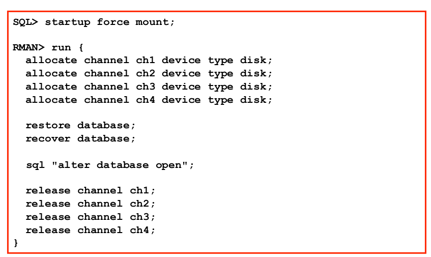
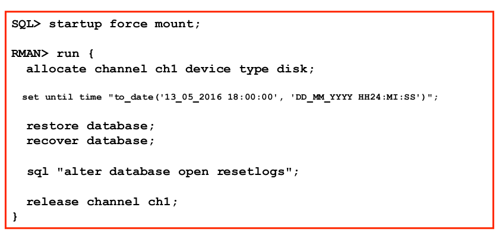

# Recovery

- Um datenfiles zu restoren müssen diese offline sein

+---------+-------------------------------+
| Restore | Datafiles kopieren aus backup |
+---------+-------------------------------+
| Recover | Redo Logs nachfahren          |
+---------+-------------------------------+

## Complete restore/recovery

# Übung 3 - Complete recovery

~~~bash
RMAN> list backup of database;

List of Backup Sets
===================

BS Key  Type LV Size       Device Type Elapsed Time Completion Time
------- ---- -- ---------- ----------- ------------ ---------------
2       Full    244.38M    DISK        00:00:05     09-MAR-18      
        BP Key: 2   Status: AVAILABLE  Compressed: NO  Tag: TAG20180309T121913
        Piece Name: /u04/fra/XE112_SITE1/backupset/2018_03_09/o1_mf_nnndf_TAG20180309T121913_fb4vfl12_.bkp
  List of Datafiles in backup set 2
  File LV Type Ckp SCN    Ckp Time  Name
  ---- -- ---- ---------- --------- ----
  1       Full 807190     09-MAR-18 /u02/oradata/XE112/system01XE112.dbf
  2       Full 807190     09-MAR-18 /u02/oradata/XE112/sysaux01XE112.dbf
  3       Full 807190     09-MAR-18 /u02/oradata/XE112/undots01XE112.dbf
  4       Full 807190     09-MAR-18 /u02/oradata/XE112/users01XE112.dbf
  5       Full 807190     09-MAR-18 /u02/oradata/XE112/tools01XE112.dbf
  6       Full 807190     09-MAR-18 /u02/oradata/XE112/hr01XE112.dbf
  7       Full 807190     09-MAR-18 /u02/oradata/XE112/versicherung_data01XE112.dbf
  8       Full 807190     09-MAR-18 /u02/oradata/XE112/webshop_data01XE112.dbf

BS Key  Type LV Size       Device Type Elapsed Time Completion Time
------- ---- -- ---------- ----------- ------------ ---------------
5       Full    244.38M    DISK        00:00:05     09-MAR-18      
        BP Key: 5   Status: AVAILABLE  Compressed: NO  Tag: TAG20180309T122105
        Piece Name: /u04/fra/XE112_SITE1/backupset/2018_03_09/o1_mf_nnndf_TAG20180309T122105_fb4vk1rn_.bkp
  List of Datafiles in backup set 5
  File LV Type Ckp SCN    Ckp Time  Name
  ---- -- ---- ---------- --------- ----
  1       Full 807259     09-MAR-18 /u02/oradata/XE112/system01XE112.dbf
  2       Full 807259     09-MAR-18 /u02/oradata/XE112/sysaux01XE112.dbf
  3       Full 807259     09-MAR-18 /u02/oradata/XE112/undots01XE112.dbf
  4       Full 807259     09-MAR-18 /u02/oradata/XE112/users01XE112.dbf
  5       Full 807259     09-MAR-18 /u02/oradata/XE112/tools01XE112.dbf
  6       Full 807259     09-MAR-18 /u02/oradata/XE112/hr01XE112.dbf
  7       Full 807259     09-MAR-18 /u02/oradata/XE112/versicherung_data01XE112.dbf
  8       Full 807259     09-MAR-18 /u02/oradata/XE112/webshop_data01XE112.dbf

  RMAN> list backup of datafile 4;

  List of Backup Sets
  ===================

  BS Key  Type LV Size       Device Type Elapsed Time Completion Time
  ------- ---- -- ---------- ----------- ------------ ---------------
  2       Full    244.38M    DISK        00:00:05     09-MAR-18      
          BP Key: 2   Status: AVAILABLE  Compressed: NO  Tag: TAG20180309T121913
          Piece Name: /u04/fra/XE112_SITE1/backupset/2018_03_09/o1_mf_nnndf_TAG20180309T121913_fb4vfl12_.bkp
    List of Datafiles in backup set 2
    File LV Type Ckp SCN    Ckp Time  Name
    ---- -- ---- ---------- --------- ----
    4       Full 807190     09-MAR-18 /u02/oradata/XE112/users01XE112.dbf

  BS Key  Type LV Size       Device Type Elapsed Time Completion Time
  ------- ---- -- ---------- ----------- ------------ ---------------
  5       Full    244.38M    DISK        00:00:05     09-MAR-18      
          BP Key: 5   Status: AVAILABLE  Compressed: NO  Tag: TAG20180309T122105
          Piece Name: /u04/fra/XE112_SITE1/backupset/2018_03_09/o1_mf_nnndf_TAG20180309T122105_fb4vk1rn_.bkp
    List of Datafiles in backup set 5
    File LV Type Ckp SCN    Ckp Time  Name
    ---- -- ---- ---------- --------- ----
    4       Full 807259     09-MAR-18 /u02/oradata/XE112/users01XE112.dbf

oracle@vm100:~/ [XE112] sqh

SQL*Plus: Release 11.2.0.2.0 Production on Fri Mar 16 09:16:12 2018

Copyright (c) 1982, 2011, Oracle.  All rights reserved.

Connected to:
Oracle Database 11g Express Edition Release 11.2.0.2.0 - 64bit Production

SQL> alter session set nls_date_format='dd.mm.yyyy hh24:mi:ss';

Session altered.

SQL> select sysdate from dual;

SYSDATE
-------------------
16.03.2018 09:16:27

SQL> CREATE TABLE TEST_USERS (name VARCHAR(10)) TABLESPACE USERS;

Table created.

SQL>  select tablespace_name from dba_tables where table_name = 'TEST_USERS';

TABLESPACE_NAME
------------------------------
USERS

SQL> INSERT INTO TEST_USERS (name) VALUES ('lars');

1 row created.

SQL> SELECT * FROM TEST_USERS;

NAME
----------
lars

SQL> select owner, tablespace_name from dba_tables where table_name = 'TEST_USERS';

OWNER                          TABLESPACE_NAME
------------------------------ ------------------------------
SYS                            USERS
~~~

Table in Tablespace kreiert.
Nun datenfile der Tabelle herausfinden:

~~~bash
SQL>  select tablespace_name from dba_tables where table_name = 'TEST_USERS';

TABLESPACE_NAME
------------------------------
USERS

FILE_NAME
--------------------------------------------------------------------------------
/u02/oradata/XE112/users01XE112.dbf
~~~

und löschen:

~~~bash
SQL> ! rm /u02/oradata/XE112/users01XE112.dbf

SQL> ! ls /u02/oradata/XE112/users01XE112.dbf
ls: cannot access /u02/oradata/XE112/users01XE112.dbf: No such file or directory

SQL> SELECT * FROM TEST_USERS;

NAME
----------
lars
~~~

Noch da weil im Memory.

~~~bash
SQL> INSERT INTO TEST_USERS (name) VALUES ('lars2');

1 row created.

SQL> commit
  2  ;

Commit complete.

SQL> SELECT * FROM TEST_USERS;

NAME
----------
lars
lars2
~~~

Kann noch `insert into` machen weil momenthan ist der letzte commit im redo log, oracle schreibt daten asynchron in die datafiles.

Checkpoint (forsiert den write auf die datafiles):
~~~bash
SQL> alter system checkpoint;
alter system checkpoint
*
ERROR at line 1:
ORA-03113: end-of-file on communication channel
Process ID: 4596
Session ID: 142 Serial number: 31

SQL> select open_mode from v$database;
ERROR:
ORA-03114: not connected to ORACLE
~~~

`via` sagt file ist weg:

~~~bash
ORA-01116: error in opening database file 4
ORA-01110: data file 4: '/u02/oradata/XE112/users01XE112.dbf'
~~~

Restore:

~~~bash
SQL> startup mount;
ORACLE instance started.

Total System Global Area  267227136 bytes
Fixed Size                  2225640 bytes
Variable Size             163580440 bytes
Database Buffers           96468992 bytes
Redo Buffers                4952064 bytes
Database mounted.

RMAN> restore datafile 4;

Starting restore at 16-MAR-18
allocated channel: ORA_DISK_1
channel ORA_DISK_1: SID=133 device type=DISK

channel ORA_DISK_1: starting datafile backup set restore
channel ORA_DISK_1: specifying datafile(s) to restore from backup set
channel ORA_DISK_1: restoring datafile 00004 to /u02/oradata/XE112/users01XE112.dbf
channel ORA_DISK_1: reading from backup piece /u04/fra/XE112_SITE1/backupset/2018_03_09/o1_mf_nnndf_TAG20180309T122105_fb4vk1rn_.bkp
channel ORA_DISK_1: piece handle=/u04/fra/XE112_SITE1/backupset/2018_03_09/o1_mf_nnndf_TAG20180309T122105_fb4vk1rn_.bkp tag=TAG20180309T122105
channel ORA_DISK_1: restored backup piece 1
channel ORA_DISK_1: restore complete, elapsed time: 00:00:01
Finished restore at 16-MAR-18

RMAN> recover datafile 4;

Starting recover at 16-MAR-18
allocated channel: ORA_DISK_1
channel ORA_DISK_1: SID=125 device type=DISK

starting media recovery

archived log for thread 1 with sequence 213 is already on disk as file /u04/fra/XE112_SITE1/archivelog/2018_03_09/o1_mf_1_213_fb4w662q_.arc
archived log for thread 1 with sequence 214 is already on disk as file /u04/fra/XE112_SITE1/archivelog/2018_03_09/o1_mf_1_214_fb4w6739_.arc
archived log for thread 1 with sequence 215 is already on disk as file /u04/fra/XE112_SITE1/archivelog/2018_03_09/o1_mf_1_215_fb4w69jr_.arc
archived log for thread 1 with sequence 216 is already on disk as file /u04/fra/XE112_SITE1/archivelog/2018_03_09/o1_mf_1_216_fb4w69js_.arc
channel ORA_DISK_1: starting archived log restore to default destination
channel ORA_DISK_1: restoring archived log
archived log thread=1 sequence=212
channel ORA_DISK_1: reading from backup piece /u04/fra/XE112_SITE1/backupset/2018_03_09/o1_mf_annnn_TAG20180309T122115_fb4vkc37_.bkp
channel ORA_DISK_1: piece handle=/u04/fra/XE112_SITE1/backupset/2018_03_09/o1_mf_annnn_TAG20180309T122115_fb4vkc37_.bkp tag=TAG20180309T122115
channel ORA_DISK_1: restored backup piece 1
channel ORA_DISK_1: restore complete, elapsed time: 00:00:01
archived log file name=/u04/fra/XE112_SITE1/archivelog/2018_03_16/o1_mf_1_212_fbq2xtqk_.arc thread=1 sequence=212
channel default: deleting archived log(s)
archived log file name=/u04/fra/XE112_SITE1/archivelog/2018_03_16/o1_mf_1_212_fbq2xtqk_.arc RECID=8 STAMP=970913866
archived log file name=/u04/fra/XE112_SITE1/archivelog/2018_03_09/o1_mf_1_213_fb4w662q_.arc thread=1 sequence=213
archived log file name=/u04/fra/XE112_SITE1/archivelog/2018_03_09/o1_mf_1_214_fb4w6739_.arc thread=1 sequence=214
media recovery complete, elapsed time: 00:00:00
Finished recover at 16-MAR-18
~~~

Restore nun ok, database öffnen:

~~~bash
SQL> alter database open;

Database altered.

SQL> SELECT * FROM TEST_USERS;

NAME
----------
lars
lars2
~~~

# PIT restore
wir möchten den Status bevor wir die Table "TEST_USERS" erstellt haben wiederherstellen.

1. DB in mount status bringen

~~~bash
SQL> startup force mount;
ORACLE instance started.

Total System Global Area  267227136 bytes
Fixed Size                  2225640 bytes
Variable Size             163580440 bytes
Database Buffers           96468992 bytes
Redo Buffers                4952064 bytes
Database mounted.
~~~

2. RMAN restore zurechtlegen:

~~~bash
run {
  set until time "to_date('16_03_2018 09:16:00', 'DD_MM_YYYY HH24:MI:SS')";
  restore database;
  recover database;
}
~~~

3. `rmanch` und ausführen:

~~~bash
oracle@vm100:~/ [XE112] rmanch                                                                  
Recovery Manager: Release 11.2.0.2.0 - Production on Fri Mar 16 10:32:29 2018                                         
Copyright (c) 1982, 2009, Oracle and/or its affiliates.  All rights reserved.     
connected to target database: XE112 (DBID=4141194335, not
using target database control file instead of recovery catalog
run {                                               
  set until time "to_date('16_03_2018 09:16:00', 'DD_MM_YYYY HH24:MI:SS')";
  restore database;
  recover database;                                 
2> 3> 4> 5> }

executing command: SET until clause

Starting restore at 16-MAR-18
allocated channel: ORA_DISK_1
channel ORA_DISK_1: SID=133 device type=DISK

channel ORA_DISK_1: starting datafile backup set restore
channel ORA_DISK_1: specifying datafile(s) to restore from backup set
channel ORA_DISK_1: restoring datafile 00001 to /u02/oradata/XE112/system01XE112.dbf
channel ORA_DISK_1: restoring datafile 00002 to /u02/oradata/XE112/sysaux01XE112.dbf
channel ORA_DISK_1: restoring datafile 00003 to /u02/oradata/XE112/undots01XE112.dbf
channel ORA_DISK_1: restoring datafile 00004 to /u02/oradata/XE112/users01XE112.dbf
channel ORA_DISK_1: restoring datafile 00005 to /u02/oradata/XE112/tools01XE112.dbf
channel ORA_DISK_1: restoring datafile 00006 to /u02/oradata/XE112/hr01XE112.dbf
channel ORA_DISK_1: restoring datafile 00007 to /u02/oradata/XE112/versicherung_data01XE112.dbf
channel ORA_DISK_1: restoring datafile 00008 to /u02/oradata/XE112/webshop_data01XE112.dbf
channel ORA_DISK_1: reading from backup piece /u04/fra/XE112_SITE1/backupset/2018_03_09/o1_mf_nnndf_TAG20180309T122105_fb4vk1rn_.bkp
channel ORA_DISK_1: piece handle=/u04/fra/XE112_SITE1/backupset/2018_03_09/o1_mf_nnndf_TAG20180309T122105_fb4vk1rn_.bkp tag=TAG20180309T122105
channel ORA_DISK_1: restored backup piece 1
channel ORA_DISK_1: restore complete, elapsed time: 00:00:07
Finished restore at 16-MAR-18

Starting recover at 16-MAR-18
using channel ORA_DISK_1

starting media recovery

archived log for thread 1 with sequence 213 is already on disk as file /u04/fra/XE112_SITE1/archivelog/2018_03_09/o1_mf_1_213_fb4w662q_.arc
archived log for thread 1 with sequence 214 is already on disk as file /u04/fra/XE112_SITE1/archivelog/2018_03_09/o1_mf_1_214_fb4w6739_.arc
archived log for thread 1 with sequence 215 is already on disk as file /u04/fra/XE112_SITE1/archivelog/2018_03_09/o1_mf_1_215_fb4w69jr_.arc
archived log for thread 1 with sequence 216 is already on disk as file /u04/fra/XE112_SITE1/archivelog/2018_03_09/o1_mf_1_216_fb4w69js_.arc
archived log for thread 1 with sequence 217 is already on disk as file /u04/fra/XE112_SITE1/archivelog/2018_03_16/o1_mf_1_217_fbq2yy7b_.arc
channel ORA_DISK_1: starting archived log restore to default destination
channel ORA_DISK_1: restoring archived log
archived log thread=1 sequence=212
channel ORA_DISK_1: reading from backup piece /u04/fra/XE112_SITE1/backupset/2018_03_09/o1_mf_annnn_TAG20180309T122115_fb4vkc37_.bkp
channel ORA_DISK_1: piece handle=/u04/fra/XE112_SITE1/backupset/2018_03_09/o1_mf_annnn_TAG20180309T122115_fb4vkc37_.bkp tag=TAG20180309T122115
channel ORA_DISK_1: restored backup piece 1
channel ORA_DISK_1: restore complete, elapsed time: 00:00:01
archived log file name=/u04/fra/XE112_SITE1/archivelog/2018_03_16/o1_mf_1_212_fbq3szl9_.arc thread=1 sequence=212
channel default: deleting archived log(s)
archived log file name=/u04/fra/XE112_SITE1/archivelog/2018_03_16/o1_mf_1_212_fbq3szl9_.arc RECID=10 STAMP=970914767
archived log file name=/u04/fra/XE112_SITE1/archivelog/2018_03_09/o1_mf_1_213_fb4w662q_.arc thread=1 sequence=213
archived log file name=/u04/fra/XE112_SITE1/archivelog/2018_03_09/o1_mf_1_214_fb4w6739_.arc thread=1 sequence=214
archived log file name=/u04/fra/XE112_SITE1/archivelog/2018_03_09/o1_mf_1_215_fb4w69jr_.arc thread=1 sequence=215
media recovery complete, elapsed time: 00:00:01
Finished recover at 16-MAR-18

SQL> alter database open resetlogs;

Database altered.

SQL> SELECT * FROM TEST_USERS;
SELECT * FROM TEST_USERS
              *
ERROR at line 1:
ORA-00942: table or view does not exist
~~~

# Export / Import

- ganze DB export möglich
- aber auch nur teile davon
- 1 Tool zum exportieren
- mehere Tools zum importieren
- sys schemen können nicht exportiert oder importiert werden
  - würde mann export von 11er DB machen mit sys und dann auf einer 12er DB wieder importieren, wäre die DB wieder eine 11er DB
- exp/imp sind alte deprecated tools (vorallem exp)
- Neu: expdp/impdp (Datapump)
  - help: expdp help=yes

# Erstellen eines Full exports

Location dump: /u01/app/oracle/admin/XE112/dmp | $ORACLE_BASE/admin/$ORACLE_SID/dmp

1. Full export mit CLI Parameter:

~~~bash
SQL> CREATE DIRECTORY MYDATAPUMPDIR AS '/u01/app/oracle/admin/XE112/dmp';

Directory created.

oracle@vm100:/u01/app/oracle/admin/XE112/dmp/ [XE112] expdp USERID=system/manager FULL=Y FLASHBACK_TIME=sysdate JOB_NAME=dp_fullexp DIRECTORY=MYDATAPUMPDIR DUMPFILE=dp_fullexp_%U.dmp LOGFILE=dp_fullexp.log

Export: Release 11.2.0.2.0 - Production on Fri Mar 16 12:18:14 2018                                      

Copyright (c) 1982, 2009, Oracle and/or its affiliates.  All rights reserved.                            

Connected to: Oracle Database 11g Express Edition Release 11.2.0.2.0 - 64bit Production                  
Starting "SYSTEM"."DP_FULLEXP":  USERID=system/******** FULL=Y FLASHBACK_TIME=sysdate JOB_NAME=dp_fullexp DIRECTORY=MYDATAPUMPDIR DUMPFILE=dp_fullexp_%U.dmp LOGFILE=dp_fullexp.log
Estimate in progress using BLOCKS method...                                                              
Processing object type DATABASE_EXPORT/SCHEMA/TABLE/TABLE_DATA                                           
Total estimation using BLOCKS method: 6.125 MB                                                           
Processing object type DATABASE_EXPORT/TABLESPACE                                                        
Processing object type DATABASE_EXPORT/PROFILE                                                           
Processing object type DATABASE_EXPORT/SYS_USER/USER                                                     
Processing object type DATABASE_EXPORT/SCHEMA/USER                                                       
Processing object type DATABASE_EXPORT/ROLE                                                              
Processing object type DATABASE_EXPORT/GRANT/SYSTEM_GRANT/PROC_SYSTEM_GRANT                              
Processing object type DATABASE_EXPORT/SCHEMA/GRANT/SYSTEM_GRANT                                         
Processing object type DATABASE_EXPORT/SCHEMA/ROLE_GRANT                                                 
Processing object type DATABASE_EXPORT/SCHEMA/DEFAULT_ROLE                                               
[...]
. . exported "WEBSHOP"."KUNDEN"                          8.453 KB       2 rows                           
. . exported "WEBSHOP"."RECHNUNGEN"                      7.226 KB       2 rows                           
. . exported "WEBSHOP"."RECH_POS"                        6.039 KB       7 rows                           
Master table "SYSTEM"."DP_FULLEXP" successfully loaded/unloaded                                          
******************************************************************************                           
Dump file set for SYSTEM.DP_FULLEXP is:                                                                  
  /u01/app/oracle/admin/XE112/dmp/dp_fullexp_01.dmp                                                      
Job "SYSTEM"."DP_FULLEXP" successfully completed at 12:18:53                                             

oracle@vm100:/u01/app/oracle/admin/XE112/dmp/ [XE112] ll                                                 
total 2996                                                                                               
drwxr-xr-x.  3 oracle dba    4096 Mar 16 12:18 .                                                         
drwxr-xr-x. 14 oracle dba    4096 Jan  2 11:18 ..                                                        
-rw-r--r--   1 oracle dba   10572 Mar 16 12:18 dp_fullexp.log                                            
-rw-r-----   1 oracle dba 3043328 Mar 16 12:18 dp_fullexp_01.dmp                                         
drwxr-xr-x   2 oracle dba    4096 Feb  4  2016 hr_schema                        
~~~

# Mit Parameter File

~~~bash
oracle@vm100:/u01/app/oracle/admin/XE112/dmp/ [XE112] cat exp.par
USERID='system/manager'
FULL=Y
FLASHBACK_TIME=sysdate
JOB_NAME=dp_fullexp
DIRECTORY=MYDATAPUMPDIR
DUMPFILE=dp_fullexp_para_%U.dmp
LOGFILE=dp_fullexp.log

oracle@vm100:/u01/app/oracle/admin/XE112/dmp/ [XE112] expdp parfile=exp.par                              

Export: Release 11.2.0.2.0 - Production on Fri Mar 16 12:23:27 2018

Copyright (c) 1982, 2009, Oracle and/or its affiliates.  All rights reserved.

Connected to: Oracle Database 11g Express Edition Release 11.2.0.2.0 - 64bit Production
Starting "SYSTEM"."DP_FULLEXP":  system/******** parfile=exp.par
Estimate in progress using BLOCKS method...
Processing object type DATABASE_EXPORT/SCHEMA/TABLE/TABLE_DATA
Total estimation using BLOCKS method: 6.125 MB
Processing object type DATABASE_EXPORT/TABLESPACE
Processing object type DATABASE_EXPORT/PROFILE
Processing object type DATABASE_EXPORT/SYS_USER/USER
Processing object type DATABASE_EXPORT/SCHEMA/USER
Processing object type DATABASE_EXPORT/ROLE
Processing object type DATABASE_EXPORT/GRANT/SYSTEM_GRANT/PROC_SYSTEM_GRANT
Processing object type DATABASE_EXPORT/SCHEMA/GRANT/SYSTEM_GRANT
Processing object type DATABASE_EXPORT/SCHEMA/ROLE_GRANT
Processing object type DATABASE_EXPORT/SCHEMA/DEFAULT_ROLE
Processing object type DATABASE_EXPORT/SCHEMA/TABLESPACE_QUOTA
Processing object type DATABASE_EXPORT/RESOURCE_COST
Processing object type DATABASE_EXPORT/TRUSTED_DB_LINK
Processing object type DATABASE_EXPORT/SCHEMA/SEQUENCE/SEQUENCE
Processing object type DATABASE_EXPORT/DIRECTORY/DIRECTORY
Processing object type DATABASE_EXPORT/DIRECTORY/GRANT/OWNER_GRANT/OBJECT_GRANT
Processing object type DATABASE_EXPORT/CONTEXT
Processing object type DATABASE_EXPORT/SCHEMA/PUBLIC_SYNONYM/SYNONYM
Processing object type DATABASE_EXPORT/SCHEMA/SYNONYM
[...]
. . exported "WEBSHOP"."RECHNUNGEN"                      7.226 KB       2 rows
. . exported "WEBSHOP"."RECH_POS"                        6.039 KB       7 rows
Master table "SYSTEM"."DP_FULLEXP" successfully loaded/unloaded
******************************************************************************
Dump file set for SYSTEM.DP_FULLEXP is:
  /u01/app/oracle/admin/XE112/dmp/dp_fullexp_para_01.dmp
Job "SYSTEM"."DP_FULLEXP" successfully completed at 12:24:04
oracle@vm100:/u01/app/oracle/admin/XE112/dmp/ [XE112] ll
total 5968
drwxr-xr-x.  3 oracle dba    4096 Mar 16 12:23 .
drwxr-xr-x. 14 oracle dba    4096 Jan  2 11:18 ..
-rw-r--r--   1 oracle dba   10462 Mar 16 12:24 dp_fullexp.log
-rw-r-----   1 oracle dba 3043328 Mar 16 12:18 dp_fullexp_01.dmp
-rw-r-----   1 oracle dba 3039232 Mar 16 12:24 dp_fullexp_para_01.dmp
-rw-r--r--   1 oracle dba     156 Mar 16 12:23 exp.par
drwxr-xr-x   2 oracle dba    4096 Feb  4  2016 hr_schema
~~~

# Import

~~~bash
oracle@vm100:/u01/app/oracle/admin/XE112/dmp/ [XE112] cat imp.par
USERID='system/manager'
FULL=N
PARALLEL=1
JOB_NAME=db_imp_webshop
DIRECTORY=MYDATAPUMPDIR
REMAP_SCHEMA=webshop:webshop_copy
SCHEMAS=WEBSHOP
EXCLUDE=statistics
DUMPFILE=dp_fullexp_01.dmp
LOGFILE=dp_imp_webshop1.log

oracle@vm100:/u01/app/oracle/admin/XE112/dmp/ [XE112] impdp parfile=imp.par

Import: Release 11.2.0.2.0 - Production on Fri Mar 16 12:31:52 2018

Copyright (c) 1982, 2009, Oracle and/or its affiliates.  All rights reserved.

Connected to: Oracle Database 11g Express Edition Release 11.2.0.2.0 - 64bit Production
Master table "SYSTEM"."DB_IMP_WEBSHOP" successfully loaded/unloaded
Starting "SYSTEM"."DB_IMP_WEBSHOP":  system/******** parfile=imp.par
Processing object type DATABASE_EXPORT/SCHEMA/USER
Processing object type DATABASE_EXPORT/SCHEMA/GRANT/SYSTEM_GRANT
Processing object type DATABASE_EXPORT/SCHEMA/ROLE_GRANT
Processing object type DATABASE_EXPORT/SCHEMA/DEFAULT_ROLE
Processing object type DATABASE_EXPORT/SCHEMA/TABLESPACE_QUOTA
Processing object type DATABASE_EXPORT/SCHEMA/PROCACT_SCHEMA
Processing object type DATABASE_EXPORT/SCHEMA/TABLE/TABLE
Processing object type DATABASE_EXPORT/SCHEMA/TABLE/TABLE_DATA
. . imported "WEBSHOP_COPY"."ARTIKEL"                    7.867 KB       5 rows
. . imported "WEBSHOP_COPY"."KUNDEN"                     8.453 KB       2 rows
. . imported "WEBSHOP_COPY"."RECHNUNGEN"                 7.226 KB       2 rows
. . imported "WEBSHOP_COPY"."RECH_POS"                   6.039 KB       7 rows
Processing object type DATABASE_EXPORT/SCHEMA/TABLE/CONSTRAINT/CONSTRAINT
Processing object type DATABASE_EXPORT/SCHEMA/TABLE/CONSTRAINT/REF_CONSTRAINT
Job "SYSTEM"."DB_IMP_WEBSHOP" successfully completed at 12:31:55
~~~

Kontrolle:

~~~bash
SQL> select table_name from dba_tables where owner = 'WEBSHOP_COPY';

TABLE_NAME
------------------------------
KUNDEN
ARTIKEL
RECHNUNGEN
RECH_POS

SQL> select table_name, tablespace_name from dba_tables where owner = 'WEBSHOP_COPY';

TABLE_NAME                     TABLESPACE_NAME
------------------------------ ------------------------------
KUNDEN                         WEBSHOP_DATA
ARTIKEL                        WEBSHOP_DATA
RECHNUNGEN                     WEBSHOP_DATA
RECH_POS                       WEBSHOP_DATA

SQL> select owner, view_name from dba_views where owner like 'WEBSHOP%';

no rows selected
~~~
