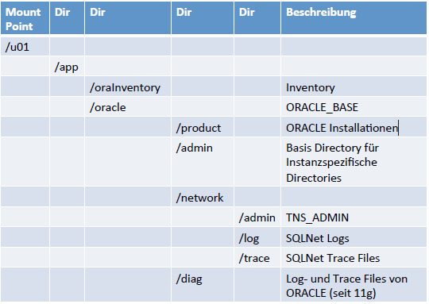
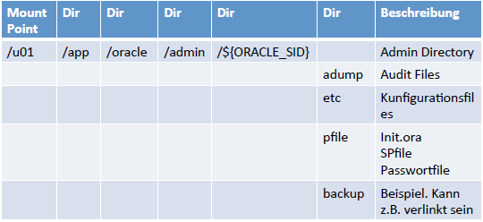
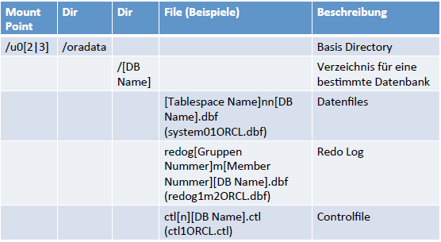
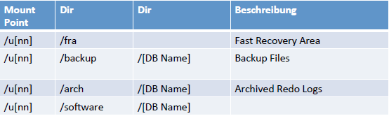

#### oratab
- Im oratab werden die existierenden Datenbanken auf einem Host
abgelegt
- Im oratab ist die korrekte Kombination ${ORACLE_SID}/$
{ORACLE_HOME} eigetragen
- Liegt unter ``/etc/``, unter Solaris in ``/var/opt/oracle``
- Format von oratab: ``${ORACLE_SID}:${ORACLE_HOME}:[Y|N]``
  - ``[Y|N]`` bezeichnet, ob eine Datenbank beim Start des Hosts gestartet
werden soll  

``DAH1114:/u00/app/oracle/product/11.1.4:Y
DAH11202:/u00/app/oracle/product/11.2.0.2:N
DAH11203:/u00/app/oracle/product/11.2.0.3:Y``

---

#### ORACLE Inventory
- Im Inventory sind alle ORACLE Installationen eines Hosts aufgeführt
- Das ORACLE Inventory liegt per Default in ``${ORACLE_BASE}/oraInventory``
- Es kann mehrere Inventory’s pro Host geben
- Der Ort des Inventory’s eines ORACLE_HOME’s ist im File ``${ORACLE_HOME}/oraInst.loc`` abgelegt

---

#### OFA - Optimal Flexible Architecture
- OFA ist eine Richtlinie von ORACLE wie die Files einer ORACLE Datenbank abgelegt werden sollen
- OFA beinhaltet Richtlinien für die Directory Struktur sowie für die Benennung der Datenfiles

> OFA wurde 1995 von Cary Millsap entwickelt

Dokumentation dazu liegt in der VM unter: ``/u01/app/oracle/local/dba/doc/ofa4.pdf``

Directorystruktur 

Admin Dir der Instanz 

DB Files 

Andere Verzeichnisse 

