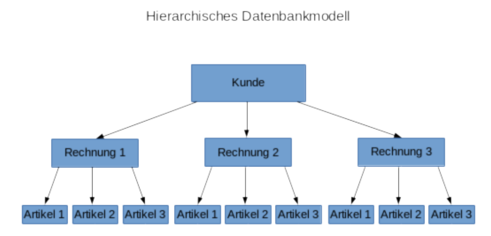
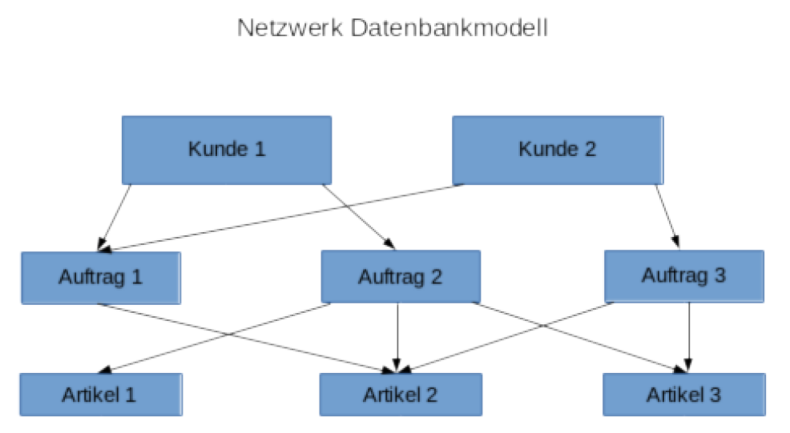
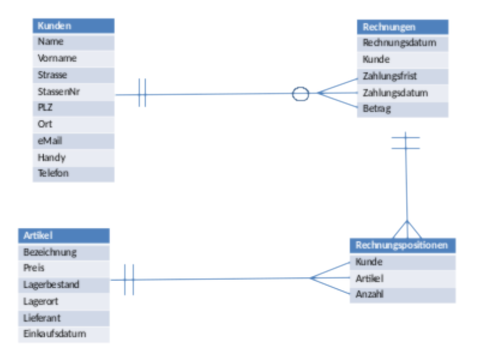

##### Datenbankmodelle
Heute wird im Wesentlichen zwischen vier verschiedenen Datenbankmodellen unterschieden: 
- Hierarchische Datenbanken
- Netzwerk Datenbanken
- Relationale Datenbanken
- Objektorientierte Datenbanken

>Der Unterschied der verschiedenen Datenbankmodellen liegt in der physischen Speicherstruktur der Daten.
Zu erwähnen sind auch die neueren „NoSQL“ Datenbanken. (Not Only SQL)
Die relationalen Datenbanken sind heute der Quasi-Standard für Datenbanken.

---

##### Hierarchische Datenbank
Das hierarchische Datenbankmodell ist das älteste Datenbankmodell.
Der logische Aufbau entspricht einer Baumstruktur. 
Der Zugriff erfolgt immer über die Wurzel in Richtung des
gesuchten Datensatzes. 
Der Vorteil von hierarchischen Datenbanken ist, dass der Zugriff sehr schnell ist, Schreiboperationen
dagegen sind eher langsam. 
- Ein weiter Nachteil hierarchischer Datenbanken:
  - Da der Zugriff immer via Wurzel erfolgt, kann jeweils nur ein Baum abgefragt werden. Somit können nur 1:1 und 1:n Beziehungen abgebildet werden. n:m Beziehungen können nur via Redundanzen
abgebildet werden.

---
##### Netzwerk Datenbanken
Netzwerkartige Datenbanken verwenden keine Baumstruktur sondern eine Art Netzwerk von Tabellen, die
miteinander in Verbindung stehen. Dies macht die Datenbank viel flexibler für Änderungen als die
hierarchischen Datenbanken, erhöht jedoch die Komplexität des Aufbaus.  Dadurch, dass mehr als eine
Basis der Daten zur Verfügung steht, sind die Abfragen jedoch weniger schnell als beim hierarchischen
Datenmodell. 
Mit dem netzwerkartigen Datenmodell können jetzt n:m Beziehungen abgebildet werden, da ein Datensatz
mehrere Root Datensätze haben kann.  
Beide Systeme sind für heutige Anwendungen, welche sehr schnell weiter entwickelt werden und daher
flexibel sein müssen, nicht mehr geeignet.

---

##### Relationale Datenbank
Eine relationale Datenbank besteht ausschliesslich aus Tabellen, die meist zu anderen Tabellen in einer
Beziehung (Relation) stehen. Das Ändern oder Hinzufügen einer Tabelle ist sehr einfach, darum werden
heutzutage meistens relationale Datenbankmodelle eingesetzt.
Für den Zugriff auf die Daten müssen oft mehrere Tabellen abgefragt werden. Im Datenmodell muss
berücksichtigt werden, dass ein Zugriff auf mehrere Tabellen performant gemacht werden kann. 
Beispiele komerzieller relationaler Datenbanken:
- Oracle Database
- Microsoft MSSQL Server
- IBM DB2

Beispiele von relationalen Opensource Datenbanken:
- MySQL
- PostgresSQL

---

##### Objektorientierte Datenbank

Eine objektorientierte Datenbank besteht aus Objekten. Ein Objekt kann z.B. eine Person, eine Abteilung
einer Firma oder ein realer Gegenstand (CD, Buch etc) sein.
Der objektorientierte Ansatz wie z.B. Klassen, Vererbung etc. Konnte sich auf Datenbankebene nie richtig
durchsetzen weil das Datenmodell so sehr aufwändig und komplex- und dadurch unflexibel wird.
Was heute durchaus verwendet wird ist eine Mischform von objektoriertierten- und relationalen
Datenbanken. Man nennt sie „objektrelationale“ Datenbanken. In Objektrelationalen Datenbanken werden
komplexe Objekte in relationalen Datenbanktabellen abgelegt. 

Beispiele von objektrelationalen Datenbanken:
- Oracle Database
- IBM DB2
- PostgresSQL
