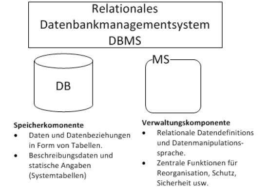

#### Relationales Datenbankmanagementsystem

Ein RDBMS besteht aus 3 Hauptkomponenten:
###### 1. Datenbank
 Die Datenbank (RD, relational Database) ist
die physische Repräsentation der Daten. 
In der Datenbank sind die Daten in Tabellen
gespeichert. Es gibt Systemtabellen, welche
durch das RDBMS verwaltet werden und
Benutzerdefinierte Tabellen, die z.B. durch
Applikationen bearbeitet werden.  
Je nach RDBMS Produkt gibt es eigene
Systemdatenbanken, in welchen die
Systeminformationen abgelegt werden oder
Systemtabellen innerhalb einer Datenbank.

###### 2. Managementsystem
Mit dem Management System (MS)
steht eine mengenrelationale
Sprachschnittstelle zur Datenbank bereit.  
Der Datenbankbenützer kann die
Datenbank mit der relationalen
Datendefinitions- und
Datenmanipulationssprache (SQL)
bearbeiten.  
Es stehen aber auch Dienstfunktionalitäten wie Datensicherung
und Wiederherstellung und Tools zum
importieren und exportieren von Tabellen
zur Verfügung.  
Je nach RDBMS Produkt stehen noch
weitere Funktionen im Bereich Security oder
Hochverfügbarkeit zur Verfügung.

###### 3. Instanz
Wird ein RDBMS gestartet, werden
verschiedene Prozesse gestartet, die uA
Memorybereiche zum Cachen der Daten zur
Verfügung stellen.
Der Memorybereich einer Datenbank wird
Instanz genannt.
