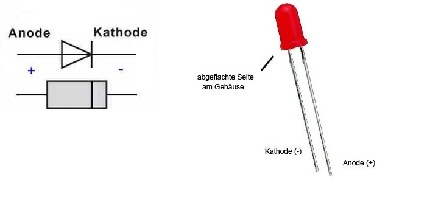
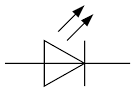
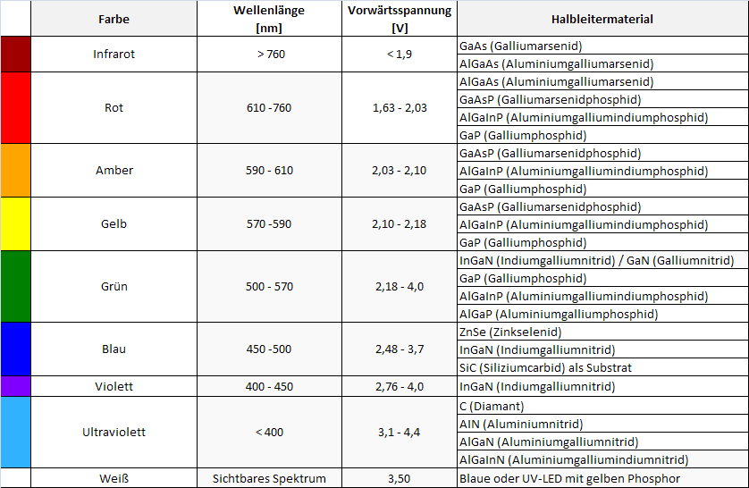
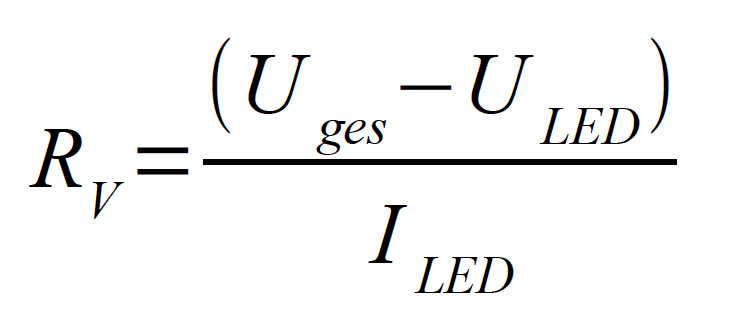

# Übersicht
- Vorstellungsrunde
- Semesterplan

# Todo
> print out Halbleitergrundlagen

# Diode
- Dioden haben zwei betriebszustände:
  - sperrt
    - es fliesst kein Strom --> URI (!) normallerweise fällt die ganze Spannung an der Diode ab
  - sperrt nicht
    - es fliesst Strom --> Normal: **0.7 V** Spannung über der Diode
  - die **Mindestspannung** einer Diode beträgt ebenfalls 0.7V unter dieser gränze leitet die Diode nicht (ausser dies ist angegeben, aussnahme)

# Dioden Schaltungs Funktion
- AND, OR, XOR und so

## AND
| Ua | Ub | Ux   |
|----|----|------|
| 0V | 0V | 0,7V |
| 0V | 5V | 0,7V |
| 5V | 0V | 0,7V |
| 5V | 5V | 5V   |

**wird-zu-AND->**

| A  | B  | X |
|----|----|---|
| 0  | 0  | 0 |
| 0  | 1  | 0 |
| 1  | 0  | 0 |
| 1  | 1  | 1 |

# LED
> so dinger wo lüchte

## General

- verschiedene farben
- verschieden grössen (3mm, 6mm)

## Schaltzeichen

## Farben

## Vorwiederstand
- Jede LED benötigt einen Wiederstand vor der LED --> Vorwiederstand
- Ohne Vorwiederstand wird der Strom gegen Unentlich gehen. Die LED würde nur kurz leuchten bevor sie "explodiert".

### Vorwiederstand Berechnen

