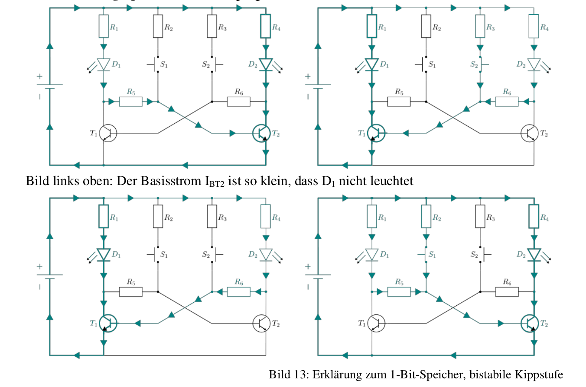
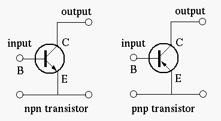
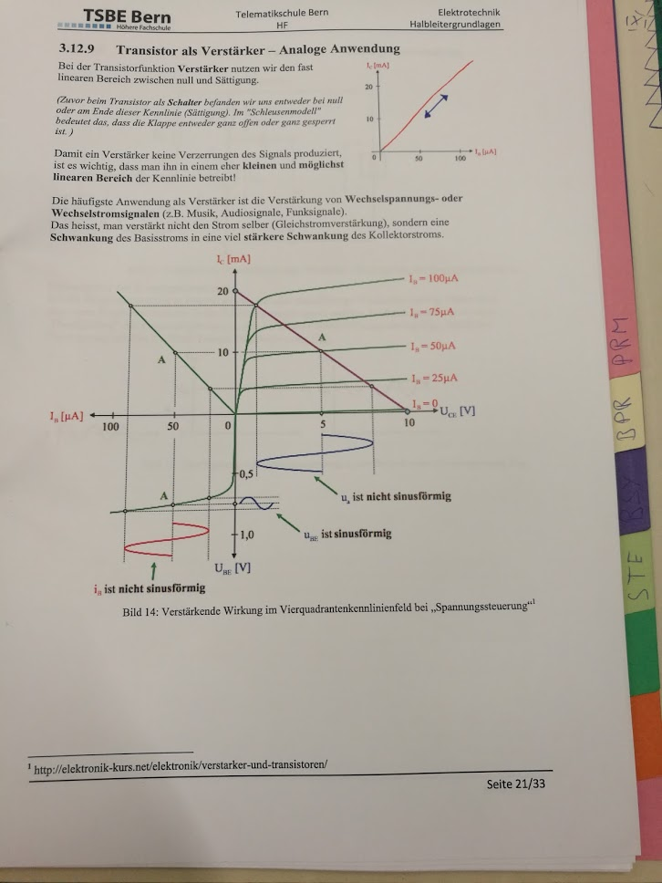

# Serie E - Aufgabenblätter
- besprechung Aufgabe 6

> Aufgabe 1 als homework

# FlipFlop (Seite 20)

- Bild 2 wird umgeschalten
- Bild 3 ist immer noch umgeschalten wegen bild 2
- Bild 4 ist wieder ursprung (bild1)

# Transistor
## Typen

## Transistor als Verstärker – Analoge Anwendung (Seite 21)

Es gibt eine verzerung.
Sinus wird in Transistor eingegeben, da aber die Kennlinie nicht linear ist, wird der output verzert.

## Beispiele: Transistor als Verstärker – Analoge Anwendung

