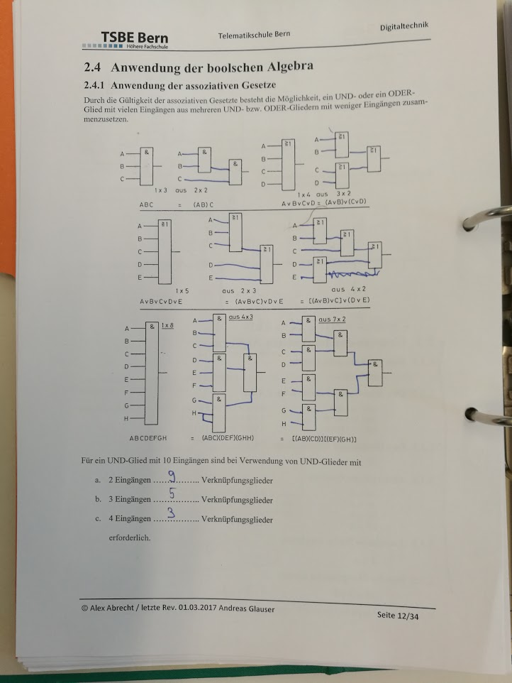
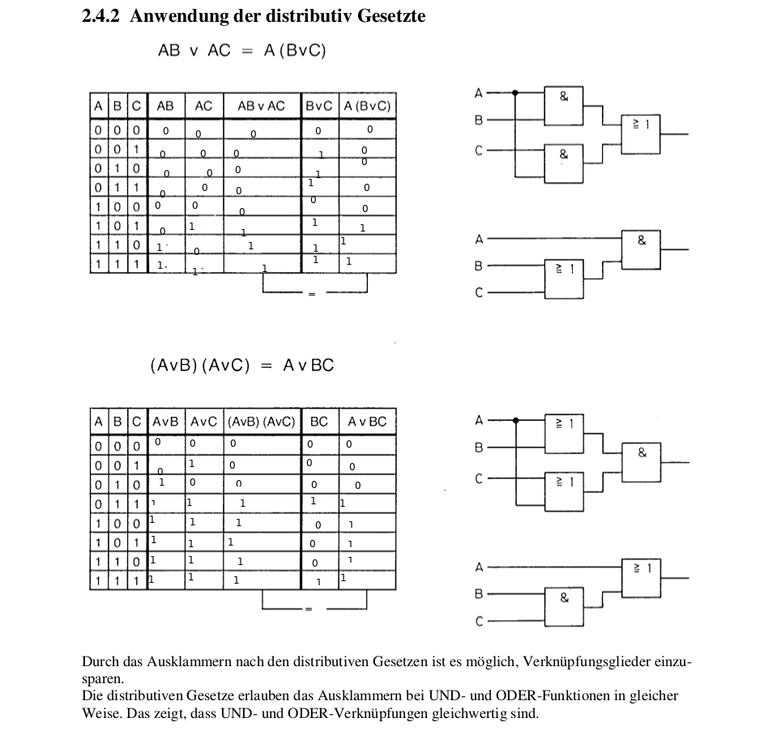
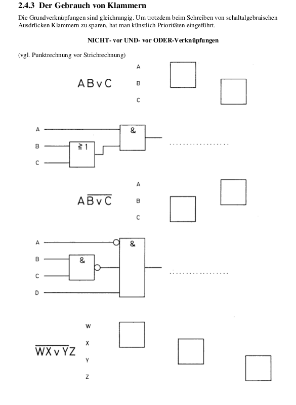

# 17.03.17
Bis und mit Seite 11 aufarbeiten!

## Wichtige Seitenim Script
- Seite 9
- Seite 11

## Asoziativ Gesetz (Seite 12)

## Asoziativ Gesetz (Seite 13)

## Gebrauch von Klammern (Seite 14)

