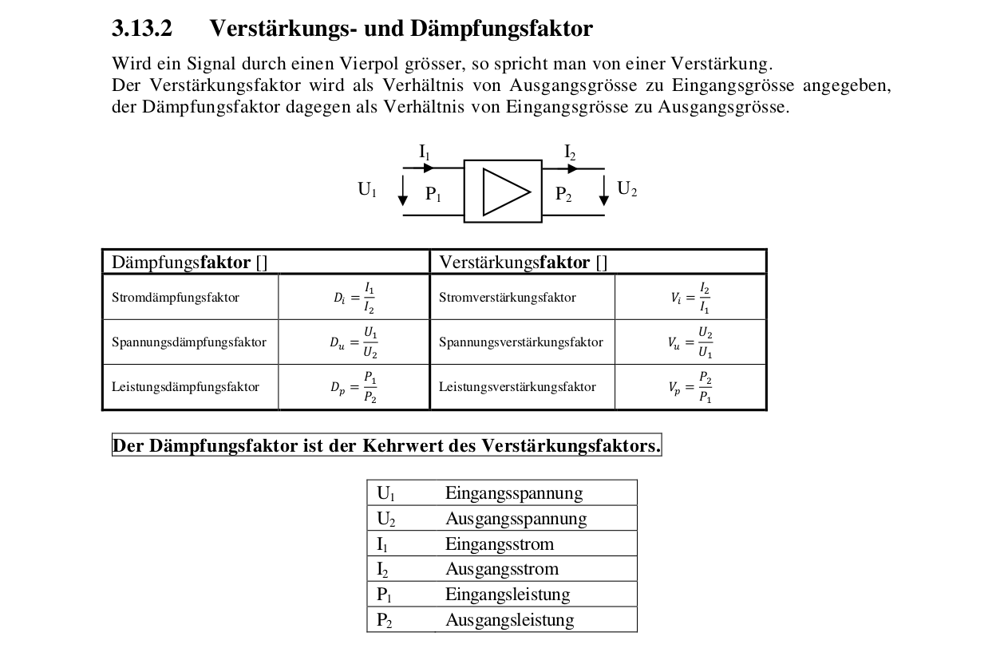
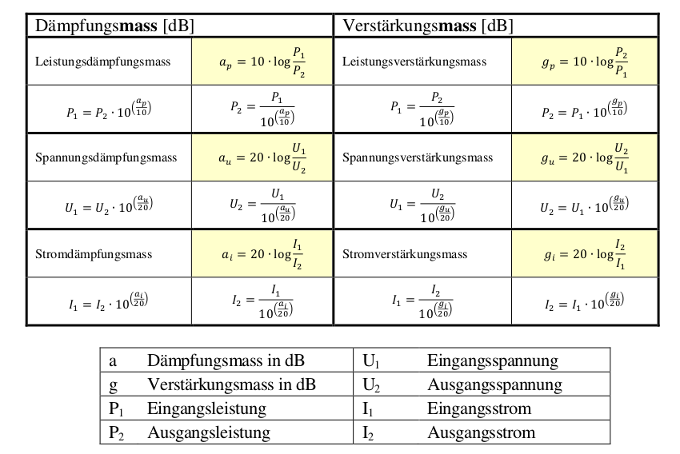
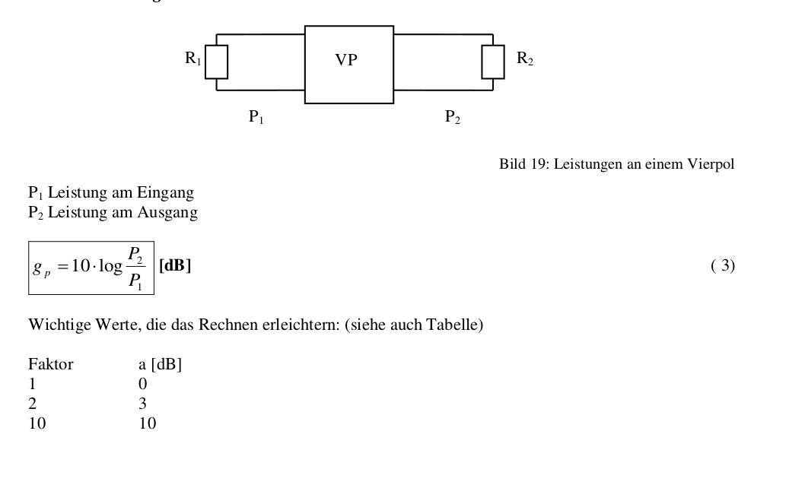
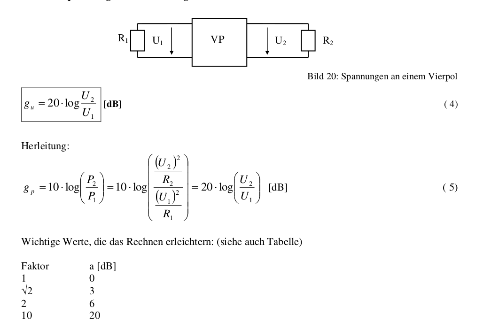
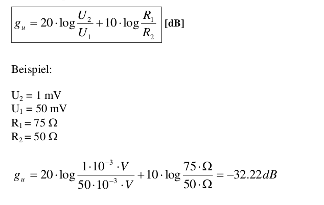
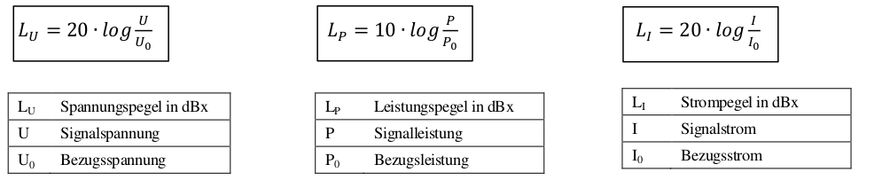
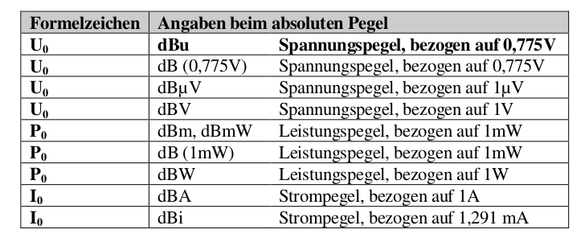
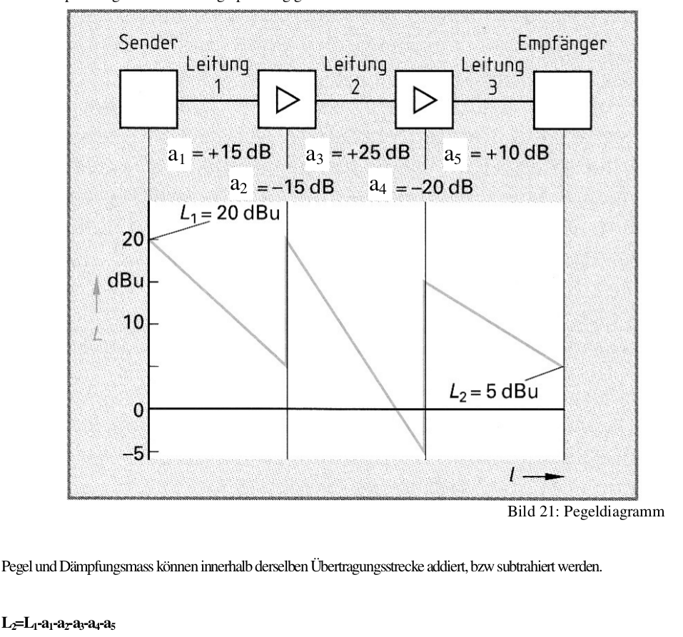

# Test
- Seite 1 - 33 im Script (seite 26 ist nicht relevant)
- Übungen: bis Serie F

# Verstärknungs und Dämpfunksfaktoren
- Faktoren sagen wie häufig verstertkt wird

### Logharitmus Gesetze
>y = log b (x) => b y = x

>y = log 10 (x) => 10 y = x

>log(x ∙ y) = log(x) + log⁡(y)

> Logharitmus ist unmkehrrechnung zum Potenzieren:

> 10^2 = 100 | log(100) = 2

# Verstätkungs- und Dämpfungsmass (R1 = R2)
wenn dezibell immer Dämpfungs**mass**

**Dämpfungsmass und Verstärkungsmass ist nicht das selbe!** --> Eingang/Ausgang sind vertauscht --> Vorzeichen wechselt weil:
log(10) = 2 | log(1/10) = -2

> Ein negatives Dämpfungsmass gibt eine Verstärkung an.

a = +2dB => -g = -2dB  ...oder... viseversa

## Dezibel

- Dezi kommt von 10 (loghatitmus base 10)
- 1 Bell sind 10 Dezibel (db)
- (1 meter sind 10 dezimeter)

# Relatives Dämpfungs- und Verstärkungsmass
Faktoren: Eingang zu Ausgang
Wenn R1 = R2:

## Spannungsverhältnis bei gleichen Widerständen R1 = R2

### WICHTIG
- ist P1/P2 => 10 * log
- ist U1/U2 => 20 * log

## Spannungsverhältnis wenn R1 ungleich R2

# Absolutes Dämpfungs- und Verstärkungsmass
## Pegel
- Absolut: bezogen auf irgendwas
- Relativ: Verhältnis zu irgendwas

Lu = Spannungspegel
Lp = Leistungspegel

L2 = -20dBu -15dB - (-15dB) - 25dB - (-20dB) - 10dB = 5dBu
