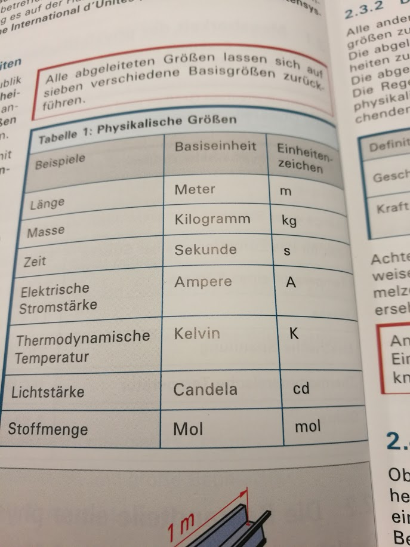
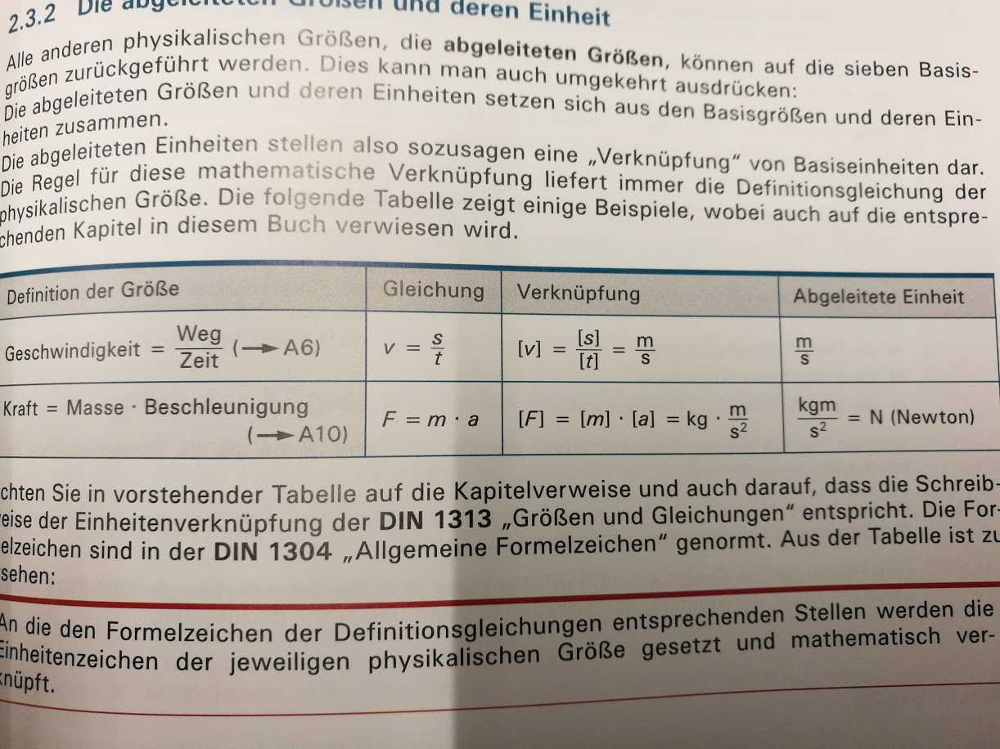
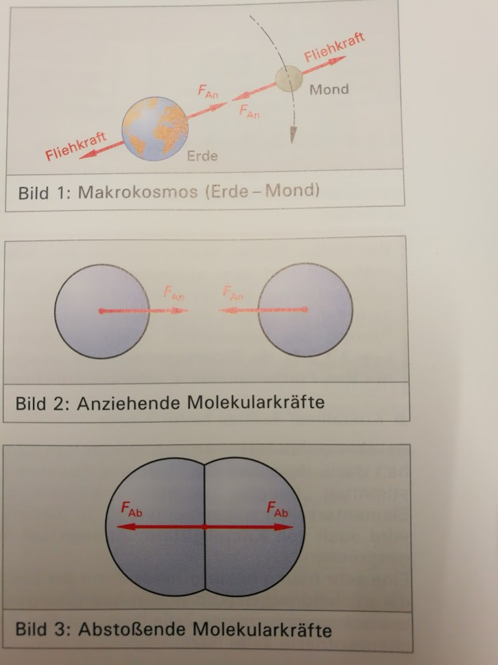
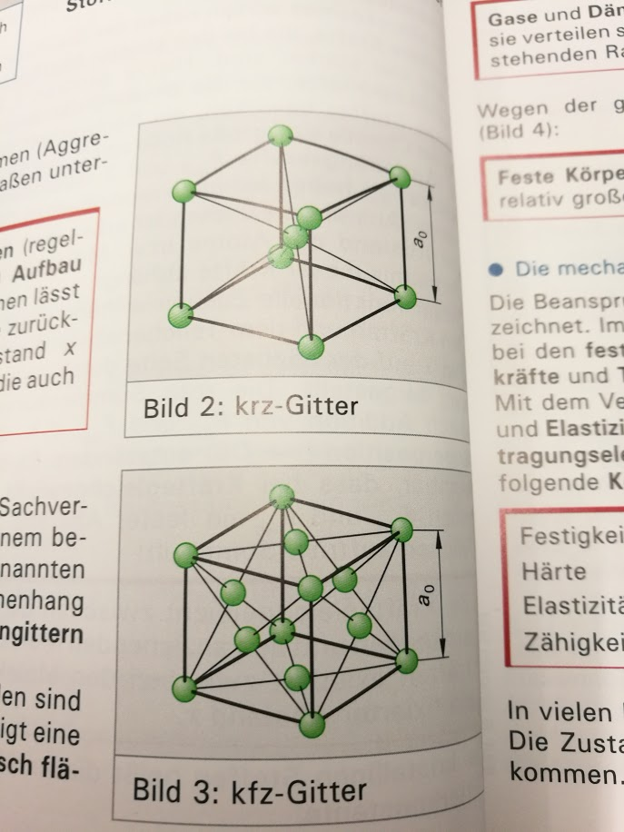
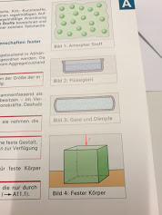
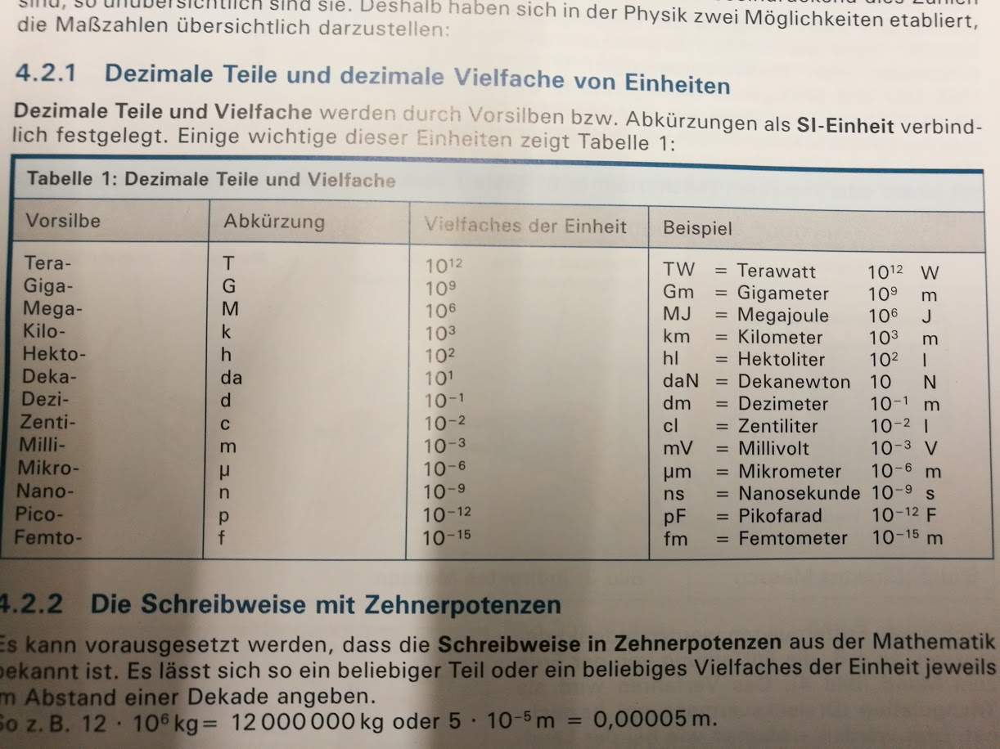
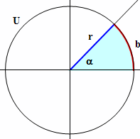
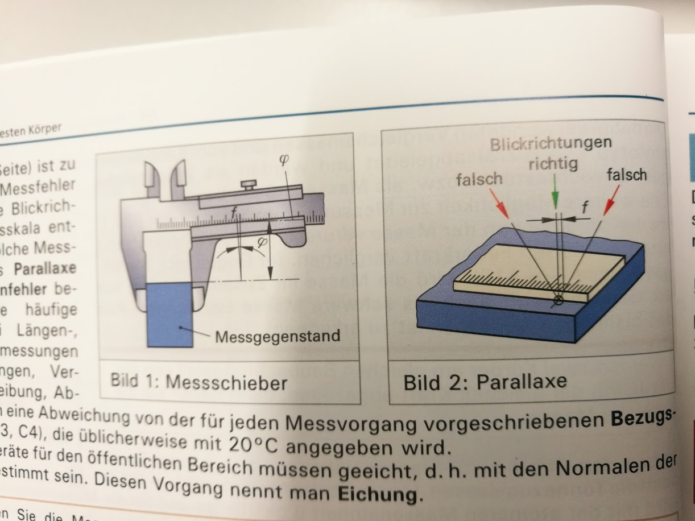
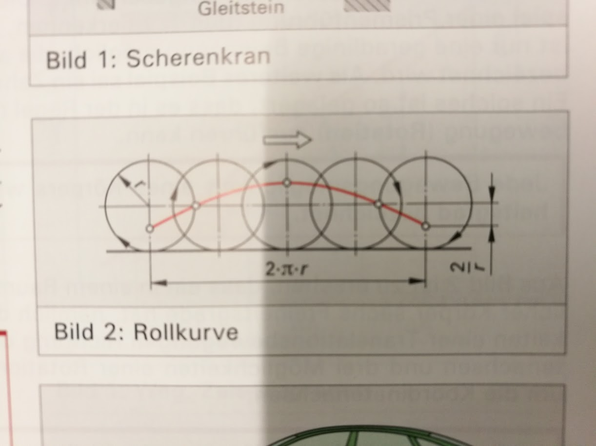
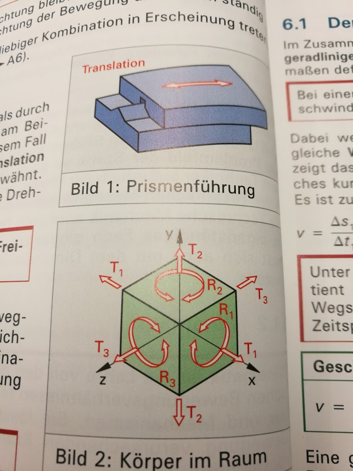

# Done
- Buch "Technische Physik / Lehr- und Aufgabenbuch" erhalten

## Messbarkeit der physikalischen Grössen (Seite 5)
> Die physikalischen Grössen sind objektiv messbare Eigenschaften von Vorgängen, Zuständen oder Objekten.

- Objektiv messen:
  - Gefühle können nicht objektiv gemessen werden
  - Genüsse können auch nicht objektiv gemessen werden
  - objektiv muss reproduzierbar und nachvollziehbar sein

> Eine physikalische Grösse besteht aus dem Produkt eines Zahlenwertes und einer Einheit:
> Physikalische Grössen verhalten sich gegenüber der verwendeten Einheit **invariant**.

bsp.: 3kg oder 3000g **invariant** (die grösse ist immer gleich Gross - egal welche Einheit)

## SI-Einheiten (Seite 6)
- Einheiten sind weltweit standardisiert
  - SI Einheiten wurde in gesetze aufgenommen

### Physikalische Grössen (SI):

All diese Einheiten werden mit Naturkonstanten berechnet, bis auf das Ur-Kilogramm (siehe 03.02.17.md)

## Abgeleitete Einheiten (Seite 7)

# Die Körper (seite 9)
- Feste Körepr
- Flüssigkeiten
- Gase bzw. Dämpfe

Wenn haut auf Tisch gelegt wird, "berührt" sich die Hand un der Tisch nicht (auf atom ebene), es ist eine gewisse gegenkraft vorhanden.

## Kohäsionskraft
- Je wärmer desto schwächer Kohäsionskraft

| Zustandsform | Kohäsionskraft | Molekülverschiebbarkeit |
|--------------|----------------|-------------------------|
| fest         | gross          | schlecht möglich        |
| flüssig      | klein          | gut möglich             |
| gasförmig    | sehr klein     | sehr gut möglich        |

## Aufbauformen

## Beansprunhchungsarten
- Festigkeit: Widerstand eines Körpers gegen Trennung und/oder Verformung
- Härte: Widerstand eines Körpers gegen das Eindringen eines anderen Körpers
- Elastizität: Rückverformung nach Entlastung
- Zähigkeit: Festigkeit und Elastizit

# Messungen and Körpern und Körpersystemen (Seite 13)

## Triangulation (Seite 14)
- mit 2 Pünkten die Distanz zum dritten vermessen
- Die schweiz wurde früher nur mit Triangulation vermessen

## Bogenmass

r = 1 | b = Bogenmass

## Dichte
1kg Metall ist schwerer als 1kg Federn

## Faslch / richtig Messen

! ein Parallax Fehler beschreibt wenn eine MEssung falsch abgelesen wird (Bild 2)

# Mechanik
## Rollkurve

# Bewegungskriterien Feste Körpern (Seite 20)
## Gleichförmige bewegung
- spüren wir nicht (Flugzeug)
- erst wenn beschleunigt oder abgebremst wird merken wir das

