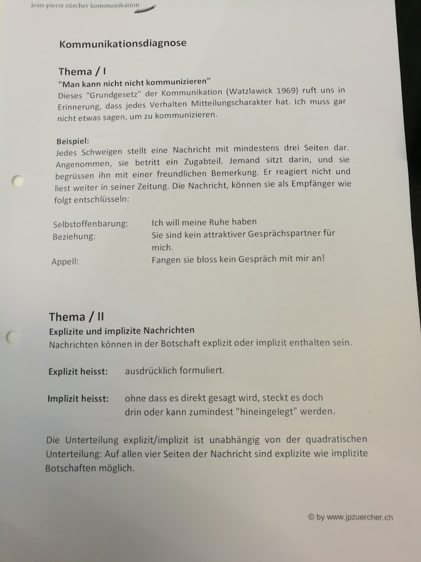
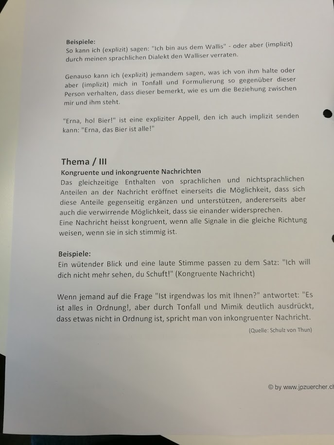
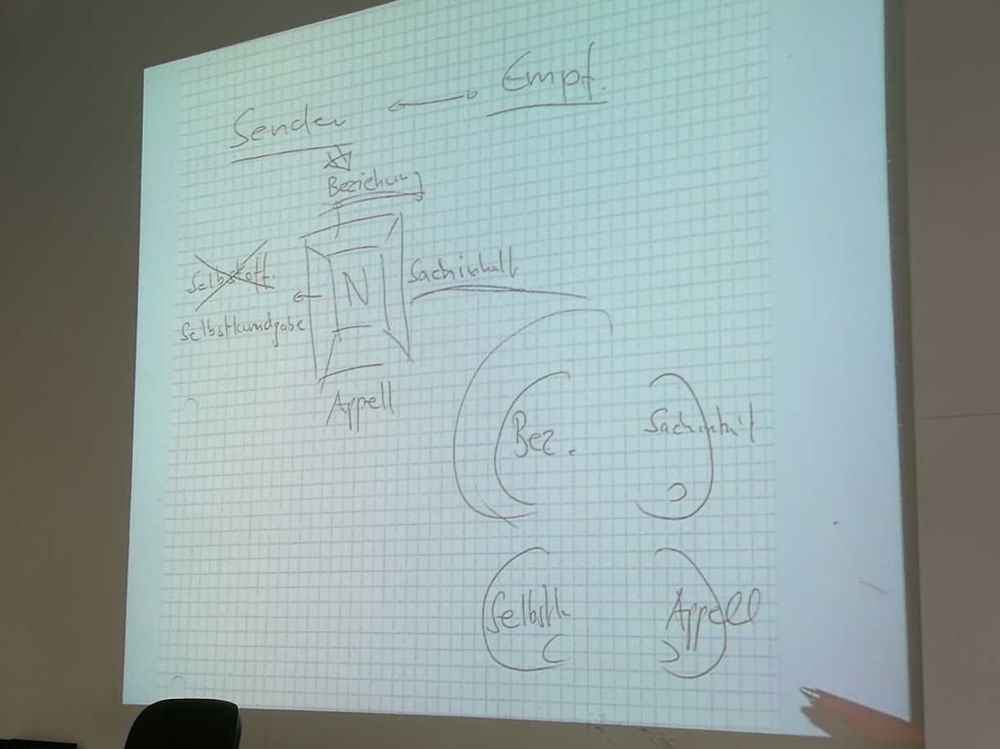
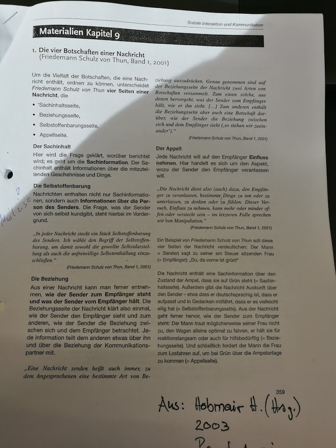
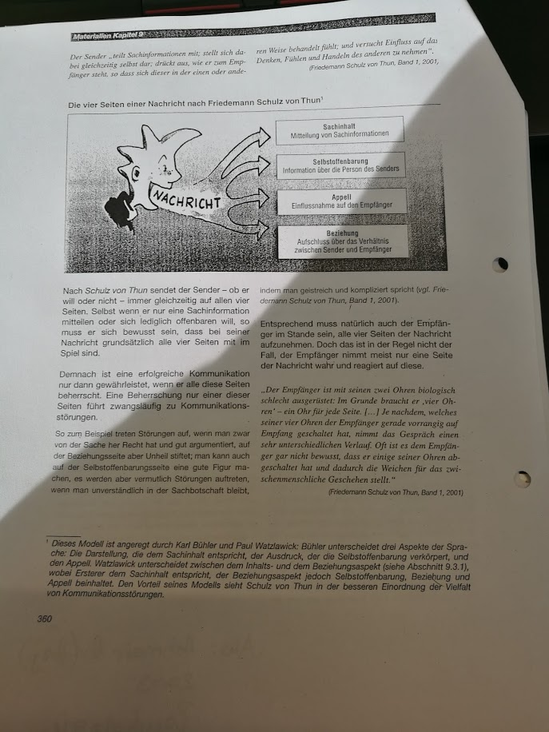
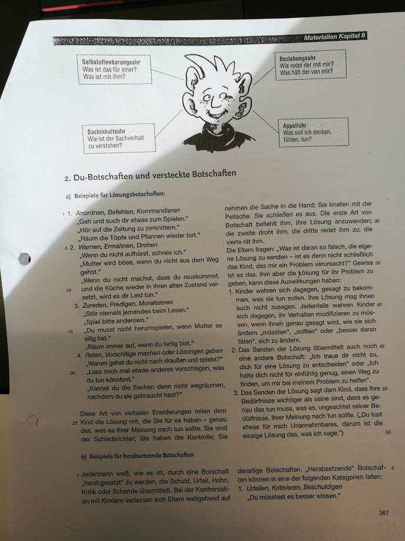
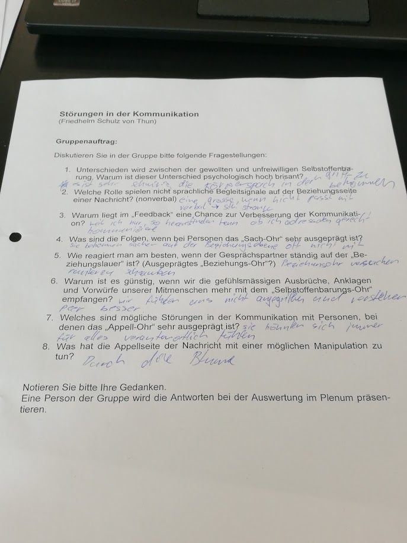

# Ablauf
- Repetition
- Watzlawick
- Kommunikationsdiagnose
- Schulz von Thun
- (Termine Präsentation)

## Kürzester Weg nach Worb
- Deutscher fragt Berner nach dem Weg nach Worb
- und verzweifelt fast dabei...
- Kommunikation !
- sogar in unserer Muttersprache können missverständinsse entsehen

## Watzlawick
Seite 4 script: Körpersprache lügt nicht
- Körpersprache beeinflussen ist sehr schwierig
- Symetrische kommunikation: auf der gleichen Ebene (wir Studenten labern untereinander)
- Komplementäre kommunikation: nicht auf der gleichen Ebene (wir labern mit Jämpu)
 - wie Vater & Sohn
 - hat nichts mit besser oder schlechter zu tun --> andere Rollen
  - nicht aus der "Rolle" fallen
  - mit 50 Jahren kann mann sich nicht verhalten wie mit 17 Jahren

## Kommunikationsdiagnose

### Thema 1
mann kann nicht nicht Kommunizieren
  - intepretationsfrage

### Thema 2
#### Explizit (ausdrücklich formuliert)
  - darf ich dich bitten mir zu Helfen diesen Tisch von a nach b zu tragen
  - ich sage genau was ich möchte (nicht durch die Blume)
#### Implizite (nicht ausdrüklich)
  - ich möchte diesen Tisch von a nach b haben, aber mein Rücken tut weh
  - durch die Blume
  - Vorteil: rückzieher ist möglich

### Thema 3
#### Kongruente und inkongruente Nachrichten
- passt die verbale und die non-verbale Kommunikation zusammen
  - Kongruent: ja
  - nicht Kongruent: nein
- Ironie funktioniert so
- Körpersprache ist verlässlicher
- Bauchgefühl

## Schulz von Thun
> auf Basis von Watzlawick
**BILD vom Script**

- Beziehungsebene
  - wie stehe ich zu meinem gegenüber
- Sachinhalt
  -  Nachricht
- Selbstkundgabe
  - man kann nicht nicht kommunizieren
  - ich sage immer etwas über meine befindlichkeit (laune)
    - ich muss das nicht explizit kommunizieren damit mein gegenüber das merkt
    - anhand von der sprache weis ich von wo mein gegenüber kommt (Deutscher, Valliser, etc...)
  - Appell
    - immer wenn ich was sage möchte ich was bewirken (->Appell)
    - jede kommunikation hat eine solche Appel Seite

### Vier-Ohren
- Beziehung
- Sachinhalt
- Appell
- Selbstkundgabe

Bei einigen leuten sind diese 4 "Ohren" nicht ausbalanciert
Evt. muss die Kommunikation angepasst werden (als Führungsperson)
  - evt. brauchen einige Leute "streicheleinheiten"

Ideal währe das alle Ohren gleich gross ausgebaut sind

