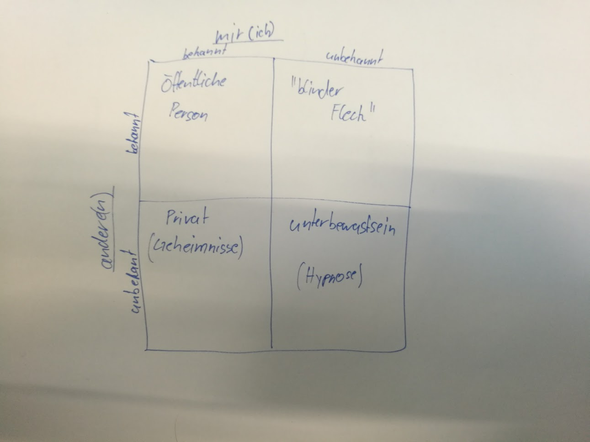

# Repetition

## Grundhaltung (Lebenshaltung)
- ich bin ok - du bist ok
  - "gute" Grundhaltung
- ich bin ok - du bsit nicht ok
  - eher "schlechte" einstellung
  - erhebliche wahrnehmung
- ich bin nicht ok - du bist ok
  - machen sich selber klein
  - alle haben Phase wo sie sich nicht selber ok finden
- ich bin nicht ok - du bist nicht ok
  - richtig verschisse...

# Störung in der Kommunikation

## Johari-Fenster
- Jonson and Harrissne darum Johari (iwie so)

### Blinder Fleck
- nicht bereit für Feedback
  - -> kein Progress möglich
- Feedback einholen
  - langsam anfangen mit Feedback einholen
  - sonst instant gebrochen

# Transaktionsanalyse
> von Ruth Kohl

- Jeder Satz den ich sage, sage ich aus dem ICH heraus

