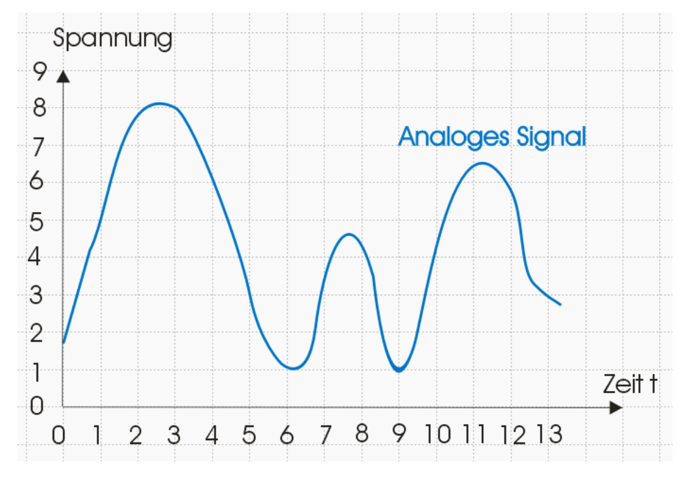

# Plan

- Fr. 02-09-18: Homework blended learning
- Fr. 02-23-18: Test

# Kontakt
~~~
Sandro Bertolino
Untere Gasse 55F
3645 Zwieselberg
sandro@bertolino.ch
sandro.bertolino@gibb.ch
~~~

# Einführung - Definition Multimedia
- im zentrum, stehen wir Menschen
- Verschiedene Kanäle:
  - Augen, Visueller Kanal
  - Ohren, Auditiver Kanal
  - Fühlen von Kräften und texturen
  - Riechen und Schmecken (4Dimensionale Kinos, auch Haumgebrauch)

--> Dies alles muss digitalisiert (codiert) werden.

# Anschlusskabel

- AV Receiver --> Audio/Visio Receiver (Home Cinema Bereich)

## Cinch (RCA Jack) / Composit Video
- Asymetrische übertragung
- Weiss: linker analoger Kanal
- Rot: rechter analoger Kanal
- Orange: Digital Audio (Coaxial)
- Schwarz (Violette): Subwoofer Kanal
- Gelb: Video

## Component Video
- nicht mehr so oft verwendet (vor HDMI bestes) 1080p (Full HD)
- Grün Yy: Helligkeit
- Blau Pb: Farbdifferenz
- Rot Pr: Farbdifferenz

## S-Video
- Farbe / schnelligkeit wird seperat übermittelt
- Besser als composit video, schlechter als Component Video
- selten bei Fernsehen, eher Überwachungskammers

## Klinkenstecker
- Wie cinch, aber kleiner
- 3 grössen: 2.5mm, 3,5mm, 6.3mm (Adapterkompatibel)
- Nachteil Professioneller Bereich: kann schmutzig werden
- Beim einstecken kurzschluss (Brummen)
  - geht eigentlich nichts defekt davon
- Mono (2 Polle - Masse/Ton) / Stereo (3 Polle) / Stereokabel mit Video (4 Polle)

# Scart
- TV heute miest mit AV Adapter
- Scart wird nur in Europa gebraucht
- 20 Pins + Abschirmblech
- Pin 1,2,3,4,6 für Ton Eingang und Ausgang
- Pin 8 (12V): Automatische Umschaltung (TV Schaltet automatisch auf diesen Eingang wenn Gerät wie Receiver Eingeschaltet wird)
- Viele Adapter
- Heute vielfach Adapter mit kleinem Scart (unstandardisiert) anschluss am TV
- HDMI (digital) zu Scart (Analog) Adapter gibts nicht, bräuchte Analog/Digital wandler

# VGA
- 1987 von IBM eingeführt
- ab 1999 Blau
- 640x480 Full HD 1920x1080 max.
- Mini VGA
- Nur Bild, keine ton übertragung
- Viele Adapter (in/out)
- 8 Pin

# BNC Klinkenstecker
- Fixer "verschluss"
- Messbereich, Funk- Videotechnik SDI. Kaum Consumer bereich
- Coaxkabel

# XLR
- Beschallungsanlagen, Mikrofon, Lautsprechersignal
- symmetrische übertragung (1 Kanal / Kabel)
- Keinen Kurzschluss beim Einstecken
- Verrigelbar
- Gehäuse wir Faradayscher Käffig

# Balanced vs. unbalanced
- Balanced (Symmetrisch) / Unbalanced (Asymetrisch)
- Symmetrische übertragung für längere Strecken (Professional)
  - Endgerät Subtrahiert beide Kanäle, Brum geht weg weil Physics bitch:

# Toslink
- von Toshiba (TOShiba-Link)
- S/PDIF (Sony/Philips Digital Interface)
- Audioübertragung, CD, DVD, Blueray, Playstation
- Pro: unentfindlich gegen elektrische und magnetischen Stör Enkopplung / Potentialtrennung der Gerätekomponenten
- Contra: 10-15m
- Teurer als Kupferkabel
- 3.5mm Miniplug Verbdinug als variante (für kleinere Geräte)

# DVI (Digital Visual Interface)
- Analog sowie Digitale übertragung
- 1920x1080 bis 2560x1600 bei 60Hz (bilder pro sekunde)

# HDMI
- High definition multimedia interface
- Neuster AV Virbindungsstandart von renomierten Marken "approved"
- "eigentlicher" Nachfolger von Scart...
- Seit 2003
- Digitale qualität, alles in einem Kabel übertragen (ton/bild)
- CEC: Consumer Electronis Control --> Protokoll für HDMI Geräte, für Fernbedienung von TV damit gerät via HDMI gesteuert werden kann

## HDMI - Steckertypen
- Typ A - Fullsize
- Typ C Mini
- Typ D Micro

## HDMI - Standards (S41. Multimedia Anschlüsse)
- 1.0 2002 3.96Gbit/S
- 1.1 2004 7.92 Gbit/s
- 1.2 2005
- 1.2a CEC
- 1.3
- 1.4 2009 Micro HDMI
  - HDMI Ethernet
  - 4K Auflösung
  - Audio Return Channel: Steuerung, Ton (ARC)
- 1.4a 2010 Volle 3D Unterstützung

## HDMI 2.0

# Display Port
- verrigelbarer Stecker
- DP1.2: 17.28Gbit/s DP1.3: 25.92 Gbit/s

# HDMI 2.1
- 4K (3840x2160 Bildpunkte mit 120Hz)
- 48Gbit/s Bandbreite

# Mini-Anschlüsse
- bei Laptops verwendet
- Thunderblot ist eigentlich mini DP

- USB C (3.1) neuer standard für AV und so

# Bits und Bytes Kommunikation

# Analog vs. digital
- Analog: stuffenlos
- Digital: 0/1
- Dinge die wir hören (bzw. Sprechen) sind immer Analog, wird gewandelt zu Digital für übertragung
- Gewüsse Frequenzen hören Menschen nicht, daher z.B. MP3 (schneidet oben und unten ab), rdukiton der "qualität"
- Fourier Analyse: welche frequenzen werden am meisten gebraucht. Wort ist:
[fourier1](fourier1.png)
hohe und tiefe freuqenzen braucht es nicht unbedingt:
[fourier2](fourier2.png)

# Digitalisierung
- Bestimmte orte haben bestimmte frequenz.
- Sampling: wie oft pro sekunde wird eine "aufnahme" des Signales gemacht. z.B. 16K/s wird geschaut welcher wert wir haben.
- Bsp: Analog Digital wandler

Nach samplen:

- --> Quantisieren
- Sampingfrequenz erhöhen (Digitales signal ist näher an Analog signal)

- --> Quantisierungsfehlre bei den Punkten die Eckig sind (digital Signal) um die Fehler zu beheben wird die Sampling frequenz erhöt. Digitales Signal ist näher am Analogen signal.
- Digitalisierte Analog werte:

## Sampling Theorem
~~~
f a muss mindestens 2 f max gross sein.
~~~

# Übungen

## ü1
Gegeben ist ein Codierverfahren mit
8 bit/Sample und einer Abtastfrequenz von
12 kHz. Welche Bandbreite in kByte/s ist
erforderlich, um diesen Datenstrom zu
übertragen? Geben Sie dazu den gesamten
Lösungsweg an.

~~~
Bandbreite: 8bit/sample * 12'000 Hz = 96'000 Bit/s
96'000 / 8 = 12'000 Bytes (/8 zu Bytes)
12'000 Bytes / 1024 = 11.71 kBytes (1kByte == 1024 Bytes)
~~~

## ü2
Ein Musikstück in Stereo von 3 Minuten und
26 Sekunden soll digitalisiert werden.
Die Abtastfrequenz beträgt 44.1 kHz und
die die Auflösung 16 bit / Kanal.
Wie gross ist das Musikstück in MByte?
~~~
3min 26s = 206s
206s * 44'100 * 16bit * 2 (weil stereo, zwei Kanäle) = 290 * 10 ^6 Bits
/8 = 36 * 10^6 Bytes
/1024 = 35'486 kByte
/1024 = 34,65 MByte
~~~

Wie gross wird das gleiche Musikstück in
mp3 mit einer Bitdatenrate von 320kbit/s?
~~~
MP3 Qualität:
206s * 320'000 bit/s = 65'920'000 bit
/8 / 1024 / 1024 = 7.85Mbyte
~~~

# Codierung
- Komprimieren (nur infos senden die gebraucht werden)

## Entropie
- Was kommt am meisten vor, z.B. Text Umlaute kommen am meisten vor

~~~
Gegeben ist die Zeichenkette ABBCAADA
Die Buchstaben-Wahrscheinlichkeit:
pa = 4 / 8 = 0.5; pb = 0.25; pc = pd = 0.125
~~~

## Datenkompression
- Verluschtfrei (nur coideren, kein Verlust)/ Verlustbehaftet (MP3, JPEG, etc...)

### Lauflängencodierung (RLE)

~~~
00000000 111  0  1  0 111111 0  111  0  1 =>
  (8)    (3) (1)(1)(1)  (6) (1) (3) (1)(1)
~~~

### LZW
- Wörterbuch wird erstellt, buchstaben werden zusammengenommen.
- Wiederkehrende abfolgen werden zusammengenommen

- Analysieren von Daten, Live codierung von Datenstrom funktioniert nicht

### Huffmann Codierung
- verlustfreie Codierung
- LZW vs. Huffmann: häufige Zahlenwerte erhalten kurze Bitcodes
- Wurzelbaum:

## Übungen

### Übung RLE
1121211232121515123122112112131 -->

### Übung LZW:
abbabba

caaccacac

tertetrter

ABFAB78AB77

### Übung Huffmann:
--> https://people.ok.ubc.ca/ylucet/DS/Huffman.html
forza ferrari
zehn ziegen ziehen
schifffahrt mit fans

