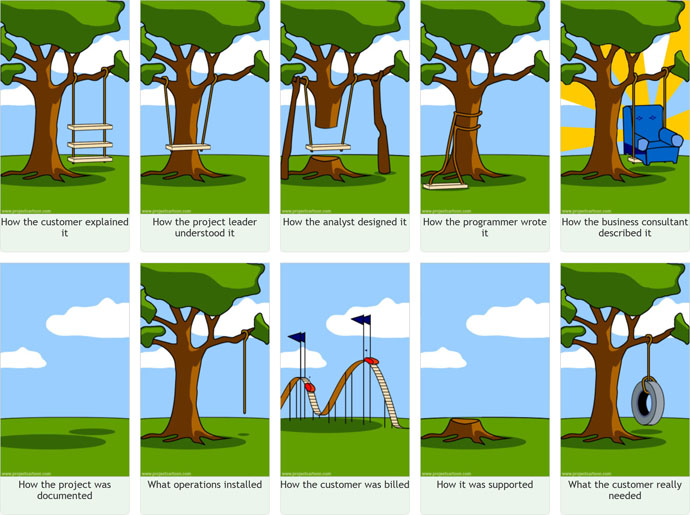

# Einleitung
> Moto: Life's too short for bad beer!

> marc.aeby@gibb.ch / +41 79 441 22 44

> **Ilias Mail eintragen!**

## How projects work

- Projektleiter sollte Technische basis haben
  - eindenken in Projekt MA um zu verstehen wo die Probleme liegen

# Fallstudie
- Teams bilden (selbständig)
- Teamcheff macht mail mit Cases in Priorisierter reihenfolge
  - First come, first serve
  - Klasse erwähnen

# Was muss ich für Schritte einleiten wenn ich ein Auto kaufe
 - 10 tätigkeiten bis auto gekauft
 - diese 10 tätigkeiten in 3 Gruppen zusammenfügen inkl. Name

## Lösung
1. Wie viel Geld habe ich zur Verfügung?
2. Parameter? (verwendungszwecks)
4. Kraftstoff verbrauch
5. 
